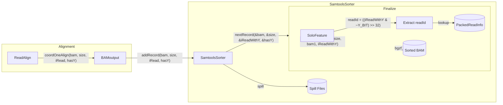

# CB/UB Tag Re-injection for Samtools Sorter

## Problem

The samtools sorter path in [`source/bamSortByCoordinate.cpp`](source/bamSortByCoordinate.cpp) streams records directly without calling `addBAMtags()`, so CB/UB tags are missing in sorted output. The legacy sorter in [`source/BAMbinSortByCoordinate.cpp`](source/BAMbinSortByCoordinate.cpp) calls `solo.soloFeat[...]->addBAMtags(bam0, size0, bam1)` before writing each record.

## Non-Goals

- No changes to inline-hash/Flex MEX output paths
- No changes to unsorted BAM tag injection

---

## Hard Error Stipulations (Testing Mode)

During initial implementation, any missing/invalid read-info conditions abort with `exitWithError`. These can be relaxed via flags later.| Condition | Action ||-----------|--------|| `pSolo.samAttrYes` but `packedReadInfo.data.empty()` | **Abort**: "PackedReadInfo not initialized for CB/UB injection" || `readId >= packedReadInfo.data.size()` | **Abort**: "readId out of range for PackedReadInfo" || `status != 0` but `cbIdx >= pSolo.cbWLstr.size()` | **Abort**: "cbIdx out of range for whitelist" || New record size > `BAM_ATTR_MaxSize` | **Abort**: "BAM record exceeds maximum size after tag injection" |---

## Stage 1: Non-Flex Parity

### Architecture



**Note**: `readId = (uint32_t)((iReadWithY & ~(1ULL<<63)) >> 32)` - must mask Y-bit before shifting.

### Code Changes

#### 1. Extend SamtoolsSorter to store iRead

**[`source/SamtoolsSorter.h`](source/SamtoolsSorter.h)**

- Add `uint64_t iRead` field to `BAMRecord` struct
- Update `addRecord()` signature: `void addRecord(const char* bamData, uint32_t bamSize, uint64_t iRead, bool hasY)`
- Update `nextRecord()` signature: `bool nextRecord(const char** bamData, uint32_t* bamSize, uint64_t* iRead, bool* hasY)`

**[`source/SamtoolsSorter.cpp`](source/SamtoolsSorter.cpp)**

- Store `iRead` in `BAMRecord` during `addRecord()`
- Serialize `iRead` in spill file format (add after `hasY` byte)
- Return `iRead` via `nextRecord()` output parameter

#### 2. Update caller to pass iRead

**[`source/BAMoutput.cpp`](source/BAMoutput.cpp)** (line ~466)

```cpp
// Current:
g_samtoolsSorter->addRecord(bamIn, bamSize, hasY);
// Change to:
g_samtoolsSorter->addRecord(bamIn, bamSize, static_cast<uint64_t>(iRead), hasY);
```


#### 3. Implement addBAMtags

**[`source/SoloFeature.h`](source/SoloFeature.h)** (line 156)

- Keep legacy signature (extracts iRead from buffer) for BAMbinSortByCoordinate/BAMbinSortUnmapped compatibility
- Add new overload with explicit iRead for samtools sorter path:
```cpp
// Legacy: extracts iRead from trailing 8 bytes at bam0+size0
void addBAMtags(char *&bam0, uint32 &size0, char *bam1);
// New: explicit iRead for samtools sorter
void addBAMtags(char *&bam0, uint32 &size0, char *bam1, uint64_t iReadWithY);
```


**New file: [`source/SoloFeature_addBAMtags.cpp`](source/SoloFeature_addBAMtags.cpp)****CRITICAL: iRead to readId conversion**

```cpp
// iRead format: bit63=Y-flag, bits[63:32]=readId, bits[31:0]=other data
// Extract readId by masking Y-bit and shifting:
uint32_t readId = static_cast<uint32_t>((iReadWithY & ~(1ULL << 63)) >> 32);
```

Key logic:

1. Early return if `!pSolo.samAttrYes` or neither CB nor UB requested
2. **Hard error checks** (abort on failure):
   ```cpp
      // Check packedReadInfo is initialized
      if (packedReadInfo.data.empty()) {
          exitWithError("PackedReadInfo not initialized for CB/UB injection", ...);
      }
      
      // Extract readId (MUST mask Y-bit before shifting)
      uint32_t readId = static_cast<uint32_t>((iReadWithY & ~(1ULL << 63)) >> 32);
      
      // Check readId in range
      if (readId >= packedReadInfo.data.size()) {
          exitWithError("readId out of range for PackedReadInfo", ...);
      }
   ```


3. Lookup from PackedReadInfo:
   ```cpp
      uint32_t cbIdx = packedReadInfo.getCB(readId);
      uint32_t umiPacked = packedReadInfo.getUMI(readId);
      uint8_t status = packedReadInfo.getStatus(readId);
   ```


4. **Status-aware tag emission** (matches recordReadInfo semantics):

- `status == 0`: skip both CB and UB (missing CB) - no error
- `status == 1`: emit both CB and UB (valid)
- `status == 2`: emit CB only, skip UB (invalid UMI)
- Do NOT skip when `umiPacked == 0` (valid all-A UMI)

5. Decode CB with bounds check:
   ```cpp
      if (status != 0 && cbIdx >= pSolo.cbWLstr.size()) {
          exitWithError("cbIdx out of range for whitelist", ...);
      }
      string cbStr = pSolo.cbWLstr[cbIdx];
   ```


6. Decode UMI using length-aware decoder (only if status == 1):
   ```cpp
      // Use convertNuclInt64toString from SequenceFuns.h
      // Skip UB if pSolo.umiL == 0 or > 16 (PackedReadInfo limit)
      if (status == 1 && pSolo.umiL > 0 && pSolo.umiL <= 16) {
          string ubStr = convertNuclInt64toString(umiPacked, pSolo.umiL);
          // append UB tag
      }
   ```


7. **Manual raw tag append** (no htslib bam_aux_append - unsafe on non-owned memory):

- Copy existing BAM record to `bam1` buffer
- Append CB tag: `CB:Z:<cbStr>\0` (3 + cbStr.size() + 1 bytes)
- Append UB tag: `UB:Z:<ubStr>\0` (3 + ubStr.size() + 1 bytes)
- Update block_size in `bam1[0..3]` (new_size - 4)
- **Hard error on size overflow**:
     ```cpp
          if (newSize > BAM_ATTR_MaxSize) {
              exitWithError("BAM record exceeds maximum size after tag injection", ...);
          }
     ```


- Set `bam0 = bam1; size0 = newSize;`

8. Leave `bam0/size0` unchanged if status == 0 (no tags to add)

**[`source/Makefile`](source/Makefile)**

- Add `SoloFeature_addBAMtags.o` to OBJECTS list

#### 4. Wire injection into finalize path

**[`source/bamSortByCoordinate.cpp`](source/bamSortByCoordinate.cpp)** (bamSortSamtoolsFinalize)

- Update function signature to accept `Solo& solo` parameter (currently commented out)
```cpp
// Add temp buffer
char bam1[BAM_ATTR_MaxSize];

// In the while loop:
uint64_t iReadWithY;
while (g_samtoolsSorter->nextRecord(&bamData, &bamSize, &iReadWithY, &hasY)) {
    char* bam0 = const_cast<char*>(bamData);
    uint32 size0 = bamSize;
    
    if (solo.pSolo.samAttrYes) {
        // Pass iReadWithY - addBAMtags extracts readId internally
        solo.soloFeat[solo.pSolo.featureInd[solo.pSolo.samAttrFeature]]
            ->addBAMtags(bam0, size0, bam1, iReadWithY);
    }
    
    // Use bam0/size0 for bgzf_write (may point to bam1 after tag injection)
    if (bgzfPrimary) bgzf_write(bgzfPrimary, bam0, size0);
    // ... Y/noY routing
}
```


#### 5. Legacy call site compatibility

**[`source/BAMbinSortByCoordinate.cpp`](source/BAMbinSortByCoordinate.cpp)** and **[`source/BAMbinSortUnmapped.cpp`](source/BAMbinSortUnmapped.cpp)**These call the legacy 3-arg signature which extracts iRead from `*(uint64_t*)(bam0 + size0)`:

```cpp
// Existing call (unchanged):
solo.soloFeat[...]->addBAMtags(bam0, size0, bam1);
```

The legacy overload implementation:

```cpp
void SoloFeature::addBAMtags(char *&bam0, uint32 &size0, char *bam1) {
    // Extract iReadWithY from trailing 8 bytes (legacy convention)
    uint64_t iReadWithY = *(uint64_t*)(bam0 + size0);
    addBAMtags(bam0, size0, bam1, iReadWithY);
}
```


### Exit Criteria (Stage 1)

- [ ] CB/UB tags present in sorted BAM for non-flex runs with `--outBAMsortMethod samtools`
- [ ] Tag content matches legacy sorter output (ordering differences allowed)
- [ ] `samtools quickcheck` passes
- [ ] No crashes with `--outSAMattributes CB UB`

---

## Stage 2: Flex Injection

### Context

Flex path uses different infrastructure (inline hash, clique correction). The `iRead` propagation from Stage 1 should work, but Flex may use a different tag source.

### Code Changes

#### 1. Verify iRead availability in Flex path

- Confirm `iRead` is populated correctly in `coordOneAlign()` for Flex runs
- If Flex uses a different readId scheme, add mapping logic

#### 2. Flex-aware tag source

**[`source/SoloFeature_addBAMtags.cpp`](source/SoloFeature_addBAMtags.cpp)**

- Check if `pSolo.inlineHashMode` or `pSolo.inlineCBCorrection` is active
- For Flex: use inline-hash or alternative CB/UB source keyed by `iRead`
- Keep UMI24 path using `decodeUMI12()` only when explicitly 12bp/24-bit encoding

#### 3. Handle Flex-specific status flags

- Flex may have different validity semantics
- Gate on appropriate status check for Flex path

### Exit Criteria (Stage 2)

- [ ] Flex sorted BAM contains CB/UB tags derived from corrected values
- [ ] No regression to non-Flex tag behavior
- [ ] `samtools view | grep CB:Z:` counts match expected

---

## Testing

### Stage 1 Tests

1. **Basic functionality**: Non-flex dataset with `--outSAMattributes CB UB --outBAMsortMethod samtools`

- Compare tag counts: `samtools view | grep -c 'CB:Z:'` vs legacy sorter
- Spot-check tag correctness for known reads

2. **Status==2 path**: Validate reads with invalid UMI emit CB only, no UB

- Create/find reads with status==2 in PackedReadInfo
- Confirm `CB:Z:` present, `UB:Z:` absent

3. **Variable UMI length**: Test with `pSolo.umiL != 12` (e.g., 8 or 16)

- Ensure length-aware `convertNuclInt64toString` is used
- Verify UB tag has correct length

4. **Hard error triggers** (negative tests):

- Empty `packedReadInfo.data` with tags requested → expect abort
- Out-of-range `readId` → expect abort
- Out-of-range `cbIdx` → expect abort

5. **Edge cases**:

- `umiPacked == 0` (all-A UMI) should emit UB tag (not skip)
- `pSolo.umiL == 0` or `> 16` should skip UB injection

### Stage 2 Tests

1. Flex dataset with same flags
2. Verify tags exist and are correct
3. Confirm no regression to non-Flex behavior

---

## Rollback

- Switch to `--outBAMsortMethod star` to use legacy sorter