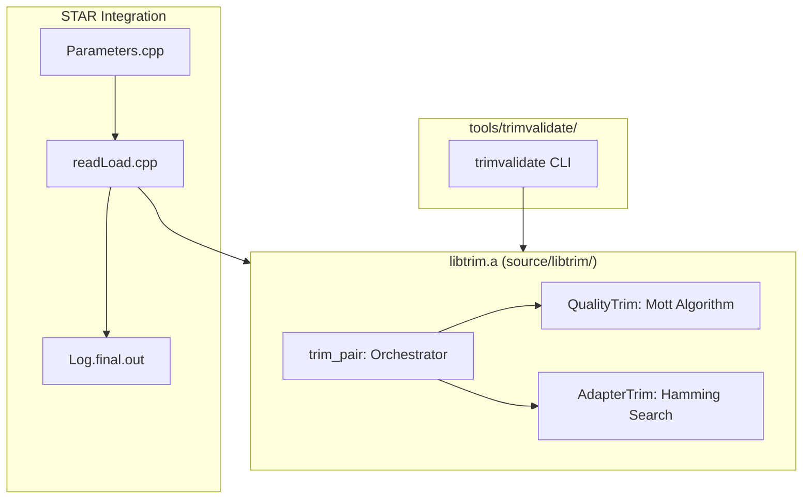
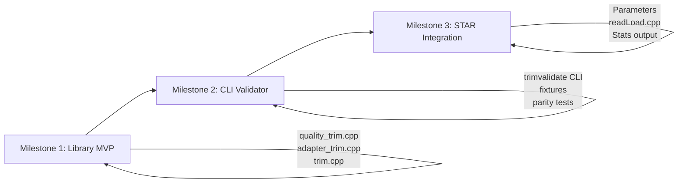

# Cutadapt-Parity Trimming Implementation

## Architecture Overview



## 1. Library: libtrim (source/libtrim/)

### Design Principles

- **Pure functions**: No static/global state. All functions operate entirely on passed buffers.
- **Thread-safe**: Any scratch arrays are stack-local. Callers can safely invoke from multiple threads.
- **Statistics**: Functions return counts of trimmed bases for aggregation by the caller.

### Core Header: `trim.h`

```cpp
#ifndef LIBTRIM_TRIM_H
#define LIBTRIM_TRIM_H

#include <stdint.h>
#include <stdbool.h>

// Default TruSeq adapter sequences (Trim Galore defaults)
#define TRUSEQ_ADAPTER_R1 "AGATCGGAAGAGCACACGTCTGAACTCCAGTCA"
#define TRUSEQ_ADAPTER_R2 "AGATCGGAAGAGCGTCGTGTAGGGAAAGAGTGT"

struct TrimParams {
    const char* adapter_r1;    // Default: TRUSEQ_ADAPTER_R1
    const char* adapter_r2;    // Default: TRUSEQ_ADAPTER_R2
    uint8_t quality_cutoff;    // Default: 20
    uint32_t min_length;       // Default: 20
    uint32_t min_overlap;      // Default: 1
    double max_error_rate;     // Default: 0.1 (mismatches = floor(overlap * 0.1))
    bool trim_5p_quality;      // Default: false (match Trim Galore)
    // Future hooks (currently unused):
    // bool trim_5p_adapter;   // Reserved for 5' adapter trimming
    // const char** extra_adapters; // Reserved for multiple adapter support
};

struct TrimResult {
    uint32_t new_length;
    uint32_t qual_trimmed_3p;  // bases trimmed by quality (3')
    uint32_t qual_trimmed_5p;  // bases trimmed by quality (5', if enabled)
    uint32_t adapter_trimmed;  // bases trimmed by adapter
    bool dropped;              // true if new_length < min_length
};

struct TrimStats {
    uint64_t reads_processed;
    uint64_t reads_trimmed;     // reads with any trimming
    uint64_t reads_too_short;   // reads dropped due to min_length
    uint64_t bases_quality_trimmed;
    uint64_t bases_adapter_trimmed;
};

// Initialize params with Trim Galore defaults
void trim_params_init(TrimParams* params);

// Single read trimming (in-place modification of seq/qual)
// Returns result with counts of trimmed bases
// Pure function: no globals, thread-safe
TrimResult trim_read(char* seq, char* qual, uint32_t len, 
                     const char* adapter, const TrimParams* params);

// Paired-end orchestrator
// Applies trim_read to both mates using adapter_r1/r2
// Sets result.dropped=true for BOTH mates if either falls below min_length
void trim_pair(char* seq1, char* qual1, uint32_t* len1,
               char* seq2, char* qual2, uint32_t* len2,
               const TrimParams* params,
               TrimResult* result1, TrimResult* result2);

// Aggregate stats helper (thread-safe if caller synchronizes)
void trim_stats_add(TrimStats* total, const TrimResult* result);

#endif // LIBTRIM_TRIM_H
```

### Key Files

- [`source/libtrim/trim.h`](source/libtrim/trim.h) - C-style API header (above)
- [`source/libtrim/trim.cpp`](source/libtrim/trim.cpp) - `trim_read`, `trim_pair`, `trim_stats_add`
- [`source/libtrim/quality_trim.cpp`](source/libtrim/quality_trim.cpp) - Mott algorithm (3' only by default)
- [`source/libtrim/adapter_trim.cpp`](source/libtrim/adapter_trim.cpp) - Hamming adapter search
- [`source/libtrim/Makefile`](source/libtrim/Makefile) - Build libtrim.a

### Mott Algorithm (quality_trim.cpp)

Cutadapt's modified Mott algorithm for 3' quality trimming. Finds the optimal cut position by maximizing a running sum where each base contributes `(quality - cutoff)`:

```cpp
// 3' quality trimming using modified Mott algorithm
// Returns new length (position to trim to)
uint32_t quality_trim_3p(const char* qual, uint32_t len, uint8_t cutoff) {
    if (len == 0) return 0;
    
    int64_t sum = 0;
    int64_t max_sum = 0;
    uint32_t cut_pos = len;  // Default: no trimming
    
    // Scan from 3' to 5', accumulating score
    for (int32_t i = (int32_t)len - 1; i >= 0; i--) {
        int score = (qual[i] - 33) - (int)cutoff;  // Phred33 encoding
        sum += score;
        
        if (sum < 0) {
            sum = 0;  // Reset negative sums (Mott modification)
        }
        if (sum > max_sum) {
            max_sum = sum;
            cut_pos = (uint32_t)i;  // Best cut position so far
        }
    }
    return cut_pos;
}

// 5' quality trimming (disabled by default, hook for future use)
// Mirrors 3' logic but scans 5' to 3'
uint32_t quality_trim_5p(const char* qual, uint32_t len, uint8_t cutoff) {
    if (len == 0) return 0;
    
    int64_t sum = 0;
    int64_t max_sum = 0;
    uint32_t cut_pos = 0;  // Default: no trimming
    
    for (uint32_t i = 0; i < len; i++) {
        int score = (qual[i] - 33) - (int)cutoff;
        sum += score;
        
        if (sum < 0) sum = 0;
        if (sum > max_sum) {
            max_sum = sum;
            cut_pos = i + 1;  // Trim up to (not including) this position
        }
    }
    return cut_pos;
}
```

### Adapter Matching (adapter_trim.cpp)

Hamming-based search matching cutadapt defaults (`-e 0.1 -O 1`, no indels):

```cpp
// Find best 3' adapter match position
// Returns position where adapter starts (seq_len if no match)
// Allows mismatches = floor(overlap * max_error_rate)
uint32_t find_adapter_3p(const char* seq, uint32_t seq_len,
                         const char* adapter, uint32_t adapter_len,
                         uint32_t min_overlap, double max_error_rate) {
    if (seq_len == 0 || adapter_len == 0) return seq_len;
    
    uint32_t best_pos = seq_len;  // No match
    uint32_t best_matches = 0;
    uint32_t best_mismatches = UINT32_MAX;
    
    // Try each starting position in the read
    for (uint32_t pos = 0; pos < seq_len; pos++) {
        uint32_t overlap = seq_len - pos;
        if (overlap < min_overlap) break;  // Not enough overlap
        
        // Compare up to adapter_len or remaining read length
        uint32_t compare_len = (overlap < adapter_len) ? overlap : adapter_len;
        uint32_t allowed_mm = (uint32_t)(compare_len * max_error_rate);  // floor()
        
        uint32_t matches = 0, mismatches = 0;
        for (uint32_t i = 0; i < compare_len; i++) {
            char s = seq[pos + i];
            char a = adapter[i];
            // Handle N as mismatch (cutadapt behavior)
            if (s == a && s != 'N') {
                matches++;
            } else {
                mismatches++;
                if (mismatches > allowed_mm) break;  // Early exit
            }
        }
        
        // Accept if within error threshold
        if (mismatches <= allowed_mm) {
            // Prefer longer matches, then fewer mismatches
            if (matches > best_matches || 
                (matches == best_matches && mismatches < best_mismatches)) {
                best_pos = pos;
                best_matches = matches;
                best_mismatches = mismatches;
            }
        }
    }
    return best_pos;
}
```

### Pipeline Order in trim_read

```
1. Quality trim 3' (Mott algorithm)
2. Quality trim 5' (if trim_5p_quality enabled - disabled by default)
3. Adapter search on quality-trimmed sequence
4. Apply adapter trim
5. Check min_length -> set dropped flag
```

## 2. CLI Validator: tools/trimvalidate/

### Purpose

Standalone tool to validate parity with Trim Galore/cutadapt on synthetic fixtures. Does NOT add cutadapt-style read-name annotations; just writes trimmed reads in standard FASTQ format.

### Files

- [`tools/trimvalidate/trimvalidate.cpp`](tools/trimvalidate/trimvalidate.cpp) - Main CLI
- [`tools/trimvalidate/Makefile`](tools/trimvalidate/Makefile) - Links against libtrim.a
- [`tools/trimvalidate/run_parity_test.sh`](tools/trimvalidate/run_parity_test.sh) - Runs all fixtures through trimvalidate and Trim Galore, diffs outputs
- [`tools/trimvalidate/README.md`](tools/trimvalidate/README.md) - Usage and parity testing instructions

### CLI Interface

```bash
# Basic usage
./trimvalidate -1 input_R1.fastq -2 input_R2.fastq \
               -o1 trimmed_R1.fastq -o2 trimmed_R2.fastq

# With options
./trimvalidate -1 input_R1.fastq -2 input_R2.fastq \
               -o1 trimmed_R1.fastq -o2 trimmed_R2.fastq \
               --quality 20 \
               --length 20 \
               --adapter-r1 AGATCGGAAGAGCACACGTCTGAACTCCAGTCA \
               --adapter-r2 AGATCGGAAGAGCGTCGTGTAGGGAAAGAGTGT
```

### Output Format

- Standard 4-line FASTQ format
- Reads that pass min_length filter are written
- Dropped pairs (either mate < min_length) are omitted from output
- No read-name annotations (unlike cutadapt's `length=X` annotations)
- Same read order as input

### Parity Test Script (run_parity_test.sh)

```bash
#!/bin/bash
# For each fixture directory:
# 1. Run trimvalidate on input_R1.fastq, input_R2.fastq
# 2. Run trim_galore (cutadapt) with same settings
# 3. Diff outputs, report pass/fail

FIXTURES_DIR="../test/fixtures/trim"
for fixture in "$FIXTURES_DIR"/*/; do
    name=$(basename "$fixture")
    echo "Testing: $name"
    
    ./trimvalidate -1 "$fixture/input_R1.fastq" -2 "$fixture/input_R2.fastq" \
                   -o1 /tmp/out_R1.fastq -o2 /tmp/out_R2.fastq
    
    # Compare with expected (generated by Trim Galore)
    if diff -q /tmp/out_R1.fastq "$fixture/expected_R1.fastq" && \
       diff -q /tmp/out_R2.fastq "$fixture/expected_R2.fastq"; then
        echo "  PASS"
    else
        echo "  FAIL"
        exit 1
    fi
done
echo "All parity tests passed!"
```

## 3. Test Fixtures: test/fixtures/trim/

Synthetic FASTQ pairs for each test case. Each fixture directory contains:

- `input_R1.fastq`, `input_R2.fastq` - Test input
- `expected_R1.fastq`, `expected_R2.fastq` - Expected output from Trim Galore
- `README.md` - Description and how to regenerate expected outputs

### Fixture Directories

- **`clean_long_insert/`** - Insert >> read length; no adapters, high quality. Expected: no trimming, reads unchanged.

- **`short_insert_overlap/`** - Insert shorter than read; adapter read-through, high quality. Expected: trim to overlap length.

- **`short_insert_with_errors/`** - Overlap + adapters with ≤10% mismatches. Expected: trim correctly despite mismatches.

- **`quality_trim_tail/`** - Low-quality tail (Q < 20) at 3' end before any adapter. Expected: quality trimming removes tail.

- **`adapter_after_quality_trim/`** - Low-quality tail that, when trimmed, exposes adapter. Expected: quality trim first, then adapter trim.

- **`below_min_length/`** - After trimming, one or both mates < 20bp. Expected: both mates dropped (empty output).

- **`paired_keep_untrimmed/`** - One mate needs trimming, other is clean. Expected: trim affected mate, keep both if lengths ≥ 20.

### Regenerating Expected Outputs

Each fixture's README.md includes instructions:

```bash
# Example: regenerate expected outputs using Trim Galore
cd test/fixtures/trim/short_insert_overlap/
trim_galore --paired --quality 20 --length 20 \
            --adapter AGATCGGAAGAGCACACGTCTGAACTCCAGTCA \
            --adapter2 AGATCGGAAGAGCGTCGTGTAGGGAAAGAGTGT \
            input_R1.fastq input_R2.fastq

mv input_R1_val_1.fq expected_R1.fastq
mv input_R2_val_2.fq expected_R2.fastq
```

## 4. STAR Integration

### New Parameters

Add to [`source/parametersDefault`](source/parametersDefault):

```
### Cutadapt-style Trimming
trimCutadapt                    -
    string: enable cutadapt-style trimming
            -    ... trimming disabled (default)
            Yes  ... enable with Trim Galore defaults (Q20, length 20, TruSeq adapters)
            NOTE: When enabled, existing clip* parameters are IGNORED for trimmed reads.
                  ClipMate clipping is bypassed; use trimCutadapt* parameters instead.

trimCutadaptQuality             20
    int: quality threshold for 3' trimming (Phred scale, default 20)

trimCutadaptMinLength           20
    int: minimum read length after trimming; pairs with either mate shorter are dropped

trimCutadaptAdapter             -
    string(s): custom adapter sequences for R1 and R2 (space-separated)
               - ... use default TruSeq adapters
               AGATCGGAAGAGCACACGTCTGAACTCCAGTCA AGATCGGAAGAGCGTCGTGTAGGGAAAGAGTGT
```

Add to [`source/Parameters.cpp`](source/Parameters.cpp):

```cpp
// In parArray initialization
{"trimCutadapt", &trimCutadapt, "-"},
{"trimCutadaptQuality", &trimCutadaptQuality, 20},
{"trimCutadaptMinLength", &trimCutadaptMinLength, 20},
{"trimCutadaptAdapter", &trimCutadaptAdapter, {"-", "-"}},
```

### Integration in readLoad.cpp

**Key change**: Move quality read BEFORE clipping. Currently `readLoad.cpp` clips (lines 60-61) before reading quality (line 64).

Modified flow in [`source/readLoad.cpp`](source/readLoad.cpp):

```cpp
int readLoad(...) {
    // 1. Read sequence (existing code, line 31)
    readInStream.getline(Seq, DEF_readSeqLengthMax+1);
    Lread = readInStream.gcount() - 1;
    LreadOriginal = Lread;
    
    // 2. Read '+' line for FASTQ (existing code, lines 52-56)
    if (readName[0] == '@') {
        readFileType = 2;
        readInStream.get(clipOneMate[0].clippedInfo);
        readInStream.ignore();
    }
    
    // 3. Read quality EARLY (moved from line 64)
    if (readName[0] == '@') {
        readInStream.getline(Qual, DEF_readSeqLengthMax);
        // ... existing quality validation ...
    }
    
    // 4. NEW: Cutadapt-style trimming (if enabled)
    if (P.trimCutadapt == "Yes") {
        // Note: This is called per-mate; trim_pair is called at the pair level
        // in ReadAlignChunk or wherever both mates are available together
        // For now, store Seq/Qual for later paired processing
        
        // Skip ClipMate when trimCutadapt is active
    } else {
        // 5. Existing ClipMate clipping (only if trimCutadapt disabled)
        convertNucleotidesToNumbers(Seq, SeqNum, Lread);
        clipOneMate[0].clip(Lread, SeqNum);  // 5p clip
        clipOneMate[1].clip(Lread, SeqNum);  // 3p clip
    }
    
    // ... rest of function ...
}
```

### Paired Trimming Integration

The actual `trim_pair` call happens where both mates are available. Add to [`source/ReadAlignChunk_mapChunk.cpp`](source/ReadAlignChunk_mapChunk.cpp) or similar:

```cpp
#include "libtrim/trim.h"

// In the read processing loop, after both mates loaded:
if (P.trimCutadapt == "Yes") {
    TrimParams params;
    trim_params_init(&params);
    params.quality_cutoff = P.trimCutadaptQuality;
    params.min_length = P.trimCutadaptMinLength;
    // Set adapters if custom
    if (P.trimCutadaptAdapter[0] != "-") {
        params.adapter_r1 = P.trimCutadaptAdapter[0].c_str();
        params.adapter_r2 = P.trimCutadaptAdapter[1].c_str();
    }
    
    TrimResult result1, result2;
    trim_pair(Seq1, Qual1, &Lread1, Seq2, Qual2, &Lread2, &params, &result1, &result2);
    
    // Accumulate thread-local stats
    threadTrimStats.reads_processed += 2;
    if (result1.new_length < LreadOriginal1 || result2.new_length < LreadOriginal2) {
        threadTrimStats.reads_trimmed += 2;
    }
    threadTrimStats.bases_quality_trimmed += result1.qual_trimmed_3p + result2.qual_trimmed_3p;
    threadTrimStats.bases_adapter_trimmed += result1.adapter_trimmed + result2.adapter_trimmed;
    
    // If dropped, skip mapping
    if (result1.dropped || result2.dropped) {
        threadTrimStats.reads_too_short += 2;
        readFilter = 'Y';  // Fail QC - same as other filters
        continue;  // Skip to next read pair
    }
    
    // Convert to numeric for alignment
    convertNucleotidesToNumbers(Seq1, SeqNum1, Lread1);
    convertNucleotidesToNumbers(Seq2, SeqNum2, Lread2);
}
```

### Per-Thread Stats Aggregation

Add `TrimStats` to thread-local storage, merge after chunk completion:

```cpp
// In ReadAlignChunk class or similar
TrimStats threadTrimStats;  // Per-thread accumulator

// After all threads complete, in main:
TrimStats globalTrimStats = {0};
for (int t = 0; t < nThreads; t++) {
    globalTrimStats.reads_processed += threadStats[t].reads_processed;
    globalTrimStats.reads_trimmed += threadStats[t].reads_trimmed;
    globalTrimStats.reads_too_short += threadStats[t].reads_too_short;
    globalTrimStats.bases_quality_trimmed += threadStats[t].bases_quality_trimmed;
    globalTrimStats.bases_adapter_trimmed += threadStats[t].bases_adapter_trimmed;
}
```

### Statistics in Log.final.out

Add section to [`source/Stats.cpp`](source/Stats.cpp) after existing read stats:

```cpp
// In Stats::reportFinal() or similar
if (P.trimCutadapt == "Yes") {
    *logFinal << "\n                        TRIMMING (cutadapt-style) |\n";
    *logFinal << "              Reads processed for trimming |" << setw(12) << trimStats.reads_processed << "\n";
    *logFinal << "                             Reads trimmed |" << setw(12) << trimStats.reads_trimmed << "\n";
    *logFinal << "     Reads dropped (below minimum length) |" << setw(12) << trimStats.reads_too_short << "\n";
    *logFinal << "                    Bases quality-trimmed |" << setw(12) << trimStats.bases_quality_trimmed << "\n";
    *logFinal << "                    Bases adapter-trimmed |" << setw(12) << trimStats.bases_adapter_trimmed << "\n";
}
```

### readFilter Handling

When `trim_pair` sets `result.dropped=true` for either mate:

- Set `readFilter = 'Y'` for both mates (fail QC filter)
- This uses STAR's existing filter mechanism - no new flag needed
- Reads with `readFilter='Y'` are skipped during mapping (same as other filters)

## 5. Build Integration

### source/libtrim/Makefile

```makefile
# Makefile for libtrim - Cutadapt-parity trimming library

CXX ?= g++
CXXFLAGS_common := -std=c++11 -O3 -Wall -Wextra
CXXFLAGS ?= -pipe
AR ?= ar

LIBTRIM_OBJECTS = trim.o quality_trim.o adapter_trim.o

all: libtrim.a

libtrim.a: $(LIBTRIM_OBJECTS)
	$(AR) rcs $@ $^
	ranlib $@

%.o: %.cpp
	$(CXX) -c $(CXXFLAGS) $(CXXFLAGS_common) -I.. $< -o $@

clean:
	rm -f $(LIBTRIM_OBJECTS) libtrim.a

.PHONY: all clean
```

### source/Makefile changes

Add to [`source/Makefile`](source/Makefile):

```makefile
# Near top, with other subdirectory libs
LIBTRIM = libtrim/libtrim.a

# Add to LDFLAGS or link line
LDFLAGS_shared := -pthread -Lhtslib -Bstatic -lhts -Bdynamic -lz -lssl -lcrypto -Llibtrim -ltrim

# Add build dependency
$(LIBTRIM):
	$(MAKE) -C libtrim

STAR: ... $(LIBTRIM) ...

# Add to clean target
clean:
	...
	$(MAKE) -C libtrim clean
```

### tools/trimvalidate/Makefile

```makefile
# Makefile for trimvalidate - CLI validator tool

CXX ?= g++
CXXFLAGS := -std=c++11 -O3 -Wall -Wextra -I../../source

LIBTRIM := ../../source/libtrim/libtrim.a

all: trimvalidate

trimvalidate: trimvalidate.cpp $(LIBTRIM)
	$(CXX) $(CXXFLAGS) -o $@ $< $(LIBTRIM)

$(LIBTRIM):
	$(MAKE) -C ../../source/libtrim

clean:
	rm -f trimvalidate

.PHONY: all clean
```

## 6. Optional Hooks (Future Enhancements)

Leave placeholders in code for future features (commented or defaulted off):

```cpp
// In TrimParams (trim.h):
struct TrimParams {
    // ... existing fields ...
    
    // Future hooks (currently unused):
    // bool trim_5p_quality;        // Already present, default false
    // bool trim_5p_adapter;        // Reserved: 5' adapter trimming
    // const char** extra_adapters; // Reserved: multiple adapter support
    // uint32_t min_length_r1;      // Reserved: per-mate min lengths
    // uint32_t min_length_r2;
    // bool keep_unpaired;          // Reserved: output unpaired reads
};
```
```cpp
// In quality_trim.cpp:
// quality_trim_5p() is implemented but not called by default
// Can be enabled via trim_5p_quality flag when needed
```

## 7. Implementation Order



### Milestone 1: Library MVP

- Create `source/libtrim/` directory
- Implement Mott algorithm in `quality_trim.cpp`
- Implement Hamming adapter search in `adapter_trim.cpp`
- Create `trim.h` API and `trim.cpp` orchestrator
- Build `libtrim.a`
- Unit tests for each function

### Milestone 2: CLI Validator

- Create `tools/trimvalidate/` directory
- Implement `trimvalidate.cpp` CLI
- Create 7 fixture directories with synthetic FASTQs
- Generate expected outputs using Trim Galore
- Create `run_parity_test.sh` for automated validation

### Milestone 3: STAR Integration

- Add parameters to `Parameters.cpp` and `parametersDefault`
- Refactor `readLoad.cpp` (move quality read earlier)
- Add `trim_pair` call in read processing loop
- Implement per-thread stats aggregation
- Add trimming section to `Log.final.out`
- Update `source/Makefile` to link `libtrim.a`
- Document in `docs/`

## 8. Key Files Summary

**Create:**

- `source/libtrim/trim.h` - API header
- `source/libtrim/trim.cpp` - Main orchestrator
- `source/libtrim/quality_trim.cpp` - Mott algorithm
- `source/libtrim/adapter_trim.cpp` - Hamming search
- `source/libtrim/Makefile` - Build libtrim.a
- `tools/trimvalidate/trimvalidate.cpp` - CLI tool
- `tools/trimvalidate/Makefile` - Build CLI
- `tools/trimvalidate/run_parity_test.sh` - Parity tests
- `tools/trimvalidate/README.md` - Documentation
- `test/fixtures/trim/` - 7 fixture directories with README each

**Modify:**

- `source/readLoad.cpp` - Move quality read, conditional trim calls
- `source/ReadAlignChunk_mapChunk.cpp` - Add trim_pair integration
- `source/Parameters.cpp` - Add trimCutadapt* parameters
- `source/Parameters.h` - Declare new parameters
- `source/parametersDefault` - Document new parameters
- `source/Stats.cpp` - Add trim stats output
- `source/Stats.h` - Add TrimStats member
- `source/Makefile` - Link libtrim.a
- `docs/STARsolo.md` or new `docs/trimming.md` - User documentation