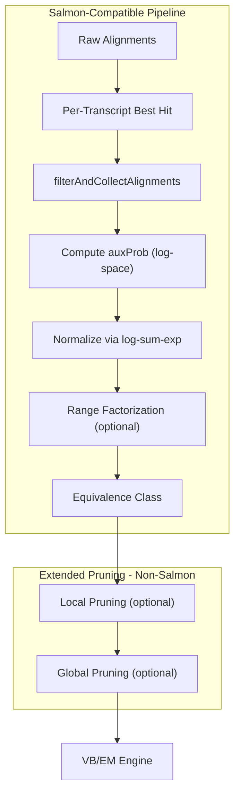

# EC Gating and Cleanup Module (Salmon-Aligned)

## Architecture Overview

This module replicates Salmon's alignment filtering and EC construction pipeline, with optional extended pruning modes.



---

## Part 1: Salmon-Compatible Filtering

### 1.1 Data Structures

Create in `source/libem/alignment_filter.h`:

```cpp
#include <cstdint>
#include <vector>
#include <limits>

// Mate status enum matching Salmon's pufferfish::util::MateStatus
enum class MateStatus : uint8_t {
    SINGLE_END = 0,
    PAIRED_END_LEFT = 1,
    PAIRED_END_RIGHT = 2,
    PAIRED_END_PAIRED = 3
};

// Raw alignment from aligner (mirrors Salmon's QuasiAlignment)
struct RawAlignment {
    uint32_t transcript_id;
    int32_t pos;
    int32_t score;              // Alignment score (SW or coverage)
    double est_aln_prob;        // Computed: exp(-scoreExp * (bestScore - score))
    double log_frag_prob;       // Log fragment length probability
    double log_compat_prob;     // Log alignment compatibility probability
    MateStatus mate_status;
    bool is_decoy;
    
    // For paired-end
    int32_t mate_score;
    int32_t fragment_len;
};

// Score tracking per read (mirrors Salmon's MappingScoreInfo)
struct MappingScoreInfo {
    int32_t best_score = std::numeric_limits<int32_t>::min();
    int32_t second_best_score = std::numeric_limits<int32_t>::min();
    int32_t best_decoy_score = std::numeric_limits<int32_t>::min();
    double decoy_thresh = 1.0;
    
    // Per-transcript best score tracking
    std::unordered_map<uint32_t, std::pair<int32_t, size_t>> best_score_per_transcript;
};

// Filter configuration matching Salmon's defaults
struct FilterParams {
    // Salmon defaults from SalmonDefaults.hpp
    double score_exp = 1.0;           // scoreExp: controls probability decay
    double min_aln_prob = 1e-5;       // minAlnProb: skip below this threshold
    double decoy_threshold = 1.0;     // decoyThreshold
    bool hard_filter = false;         // hardFilter: if true, keep only best score
    uint32_t max_read_occs = 200;     // maxReadOccs: discard if > this many hits
};
```


### 1.2 filterAndCollectAlignments Implementation

This is the core filtering function matching Salmon's `SalmonMappingUtils.hpp` lines 271-390:

```cpp
// In alignment_filter.cpp

// Step 1: Update per-transcript best scores (called per alignment)
void updateRefMappings(
    uint32_t tid, int32_t score, bool is_compat, size_t idx,
    const std::vector<bool>& is_decoy,
    MappingScoreInfo& msi,
    std::vector<int32_t>& scores
) {
    // Decoy handling
    if (is_decoy[tid]) {
        if (score > msi.best_decoy_score) {
            msi.best_decoy_score = score;
        }
        return;
    }
    
    // Decoy threshold check
    int32_t decoy_cutoff = static_cast<int32_t>(msi.decoy_thresh * msi.best_decoy_score);
    if (score < decoy_cutoff) {
        scores[idx] = std::numeric_limits<int32_t>::min();
        return;
    }
    
    // Per-transcript best hit tracking (Salmon keeps only best hit per transcript)
    auto it = msi.best_score_per_transcript.find(tid);
    if (it == msi.best_score_per_transcript.end()) {
        msi.best_score_per_transcript[tid] = {score, idx};
    } else if (score > it->second.first || (score == it->second.first && is_compat)) {
        scores[it->second.second] = std::numeric_limits<int32_t>::min(); // Invalidate old
        it->second = {score, idx};
    } else {
        scores[idx] = std::numeric_limits<int32_t>::min(); // Invalidate this one
    }
    
    // Update global best scores
    if (score > msi.best_score) {
        msi.second_best_score = msi.best_score;
        msi.best_score = score;
    }
}

// Step 2: Filter and collect alignments
std::vector<RawAlignment> filterAndCollectAlignments(
    std::vector<RawAlignment>& alignments,
    const FilterParams& params,
    MappingScoreInfo& msi
) {
    std::vector<RawAlignment> filtered;
    
    // Apply hard vs soft filter
    int32_t filter_threshold = params.hard_filter 
        ? msi.best_score 
        : static_cast<int32_t>(msi.decoy_thresh * msi.best_decoy_score);
    
    double best_score_d = static_cast<double>(msi.best_score);
    
    for (auto& aln : alignments) {
        if (aln.score < filter_threshold) continue;
        
        // Compute estAlnProb = exp(-scoreExp * (bestScore - currScore))
        double v = best_score_d - static_cast<double>(aln.score);
        aln.est_aln_prob = params.hard_filter ? 1.0 : std::exp(-params.score_exp * v);
        
        // Skip if below minAlnProb (soft filter only)
        if (!params.hard_filter && aln.est_aln_prob < params.min_aln_prob) {
            continue;
        }
        
        filtered.push_back(aln);
    }
    
    // Discard if too many hits
    if (filtered.size() > params.max_read_occs) {
        filtered.clear();
    }
    
    return filtered;
}
```

---

## Part 2: EC Construction with auxProb

### 2.1 Data Structures

Create in `source/libem/ec_builder.h`:

```cpp
// Configuration for EC building
struct ECBuilderParams {
    bool use_range_factorization = false;
    uint32_t range_factorization_bins = 4;   // Salmon default
    bool use_rank_eq_classes = false;        // Sort by conditional prob
    bool use_frag_len_dist = true;
    bool use_error_model = false;
};

// Intermediate representation before EC aggregation
struct ReadMapping {
    std::vector<uint32_t> transcript_ids;
    std::vector<double> aux_probs;     // Log-space initially, then normalized
    double aux_denom;                   // log-sum for normalization
};
```


### 2.2 auxProb Computation

Matching Salmon's `SalmonQuantify.cpp` lines 506-530:

```cpp
// Compute auxProb for each transcript in a read's alignments
ReadMapping computeAuxProbs(
    const std::vector<RawAlignment>& alignments,
    const ECBuilderParams& params
) {
    ReadMapping mapping;
    mapping.aux_denom = LOG_0;  // -infinity in log space
    
    for (const auto& aln : alignments) {
        // auxProb = logFragProb + logFragCov + logAlignCompatProb
        // where logFragCov = log(estAlnProb)
        double log_frag_cov = (aln.est_aln_prob > 0) 
            ? std::log(aln.est_aln_prob) 
            : LOG_0;
        
        double aux_prob = aln.log_frag_prob + log_frag_cov + aln.log_compat_prob;
        
        if (aux_prob == LOG_0) continue;
        
        mapping.transcript_ids.push_back(aln.transcript_id);
        mapping.aux_probs.push_back(aux_prob);
        mapping.aux_denom = logAdd(mapping.aux_denom, aux_prob);  // log-sum-exp
    }
    
    // Normalize: convert from log to probability space
    for (auto& p : mapping.aux_probs) {
        p = std::exp(p - mapping.aux_denom);
    }
    
    return mapping;
}
```


### 2.3 Range Factorization

Matching Salmon's `SalmonQuantify.cpp` lines 578-586:

```cpp
// Apply range factorization by appending bin IDs to transcript list
void applyRangeFactorization(
    std::vector<uint32_t>& txp_ids,
    const std::vector<double>& aux_probs,
    uint32_t range_factorization_bins
) {
    if (range_factorization_bins == 0) return;
    
    int32_t txps_size = txp_ids.size();
    // rangeCount = sqrt(n) + bins (Salmon's formula)
    int32_t range_count = static_cast<int32_t>(std::sqrt(txps_size)) + range_factorization_bins;
    
    // Append range bin numbers as pseudo-transcript IDs
    for (int32_t i = 0; i < txps_size; i++) {
        int32_t range_number = static_cast<int32_t>(aux_probs[i] * range_count);
        txp_ids.push_back(static_cast<uint32_t>(range_number));
    }
}
```


### 2.4 Rank Equivalence Classes (Optional)

Matching Salmon's `SalmonQuantify.cpp` lines 557-575:

```cpp
// Sort transcripts by conditional probability for rank-based ECs
void applyRankEqClasses(
    std::vector<uint32_t>& txp_ids,
    std::vector<double>& aux_probs
) {
    std::vector<size_t> inds(txp_ids.size());
    std::iota(inds.begin(), inds.end(), 0);
    
    std::sort(inds.begin(), inds.end(), [&aux_probs](size_t i, size_t j) {
        return aux_probs[i] < aux_probs[j];
    });
    
    std::vector<uint32_t> txp_ids_new(txp_ids.size());
    std::vector<double> aux_probs_new(aux_probs.size());
    for (size_t r = 0; r < inds.size(); ++r) {
        txp_ids_new[r] = txp_ids[inds[r]];
        aux_probs_new[r] = aux_probs[inds[r]];
    }
    
    std::swap(txp_ids, txp_ids_new);
    std::swap(aux_probs, aux_probs_new);
}
```

---

## Part 3: Extended Pruning (Non-Salmon, Optional)

These are **NOT** Salmon behaviors and should be disabled for parity testing.

### 3.1 Configuration

```cpp
struct ExtendedPruningParams {
    bool enable_local_pruning = false;    // Default OFF for Salmon parity
    double min_local_prob = 1e-3;
    
    bool enable_global_pruning = false;   // Default OFF for Salmon parity
    double min_global_abundance = 1e-7;
};
```


### 3.2 Local Pruning (Optional)

```cpp
// Remove low-probability transcripts from individual ECs
// NOT part of Salmon - use only when enable_local_pruning = true
void applyLocalPruning(EC& ec, double min_local_prob) {
    // ... (as in original plan)
}
```


### 3.3 Global Pruning (Optional)

```cpp
// Remove transcripts with low total weight across all ECs
// NOT part of Salmon - use only when enable_global_pruning = true  
void applyGlobalPruning(ECTable& ecs, double min_global_abundance) {
    // ... (as in original plan)
}
```

---

## Part 4: Updated Data Model

### 4.1 Full RawAlignment Structure

```cpp
struct RawAlignment {
    uint32_t transcript_id;
    int32_t pos;
    int32_t score;                  // Alignment score
    int32_t mate_score;             // Mate alignment score (paired-end)
    int32_t fragment_len;           // Fragment length
    
    // Log-space probabilities
    double log_aux;                 // Log auxiliary probability
    double log_frag_prob;           // Log fragment length probability
    double log_compat_prob;         // Log compatibility probability
    double log_error_prob;          // Log error model probability (if enabled)
    
    // Computed values
    double est_aln_prob;            // exp(-scoreExp * (bestScore - score))
    
    // Flags
    MateStatus mate_status;
    bool is_decoy;
    bool is_fw;                     // Forward orientation
    bool is_compat;                 // Compatible with library type
    
    // For debugging/tracing
    int32_t best_score;             // Best score for this read
};
```


### 4.2 Updated EC Structure

Extend existing `EC` in `em_types.h`:

```cpp
struct EC {
    std::vector<uint32_t> transcript_ids;  // May include range bin IDs if factorized
    std::vector<double> weights;           // Normalized auxProbs (combinedWeights)
    double count;                          // Read count
    
    // Metadata for Salmon compatibility
    bool is_range_factorized = false;
    size_t original_txp_count = 0;         // Before range factorization
};
```

---

## Part 5: Unit Tests (Salmon-Specific)

### 5.1 Test Scenarios

Create in `tools/ec_filter_test/`:**Test 1: hardFilter Behavior**

- Input: Alignments with scores [100, 95, 90]
- With hardFilter=true: only score=100 kept
- With hardFilter=false: all kept (if above decoy threshold)

**Test 2: minAlnProb Gating**

- Input: bestScore=100, currScores=[100, 95, 50], scoreExp=1.0
- estAlnProb for score=50: exp(-1.0 * 50) is negligible
- Assert: score=50 filtered out due to minAlnProb=1e-5

**Test 3: Per-Transcript Best Hit**

- Input: Two alignments to same transcript, scores [95, 100]
- Assert: Only score=100 alignment kept

**Test 4: Decoy Threshold**

- Input: bestDecoyScore=80, decoyThresh=1.0, alignment score=75
- Assert: Alignment filtered (75 < 1.0 * 80)

**Test 5: Range Factorization Bins**

- Input: EC with 4 transcripts, auxProbs=[0.5, 0.3, 0.15, 0.05]
- rangeFactorizationBins=4
- rangeCount = sqrt(4) + 4 = 6
- Expected bin IDs: [3, 1, 0, 0] appended to txpIDs

**Test 6: rankEqClasses**

- Input: txpIDs=[A,B,C], auxProbs=[0.5, 0.1, 0.4]
- Expected sorted: [B,C,A] with auxProbs=[0.1, 0.4, 0.5]

### 5.2 Fixture Generation

```python
# generate_fixtures.py
def generate_hard_filter_test():
    return {
        "test_id": "hard_filter",
        "alignments": [
            {"tid": 0, "score": 100},
            {"tid": 1, "score": 95},
            {"tid": 2, "score": 90}
        ],
        "params": {"hard_filter": True},
        "expected_tids": [0]
    }

def generate_min_aln_prob_test():
    return {
        "test_id": "min_aln_prob",
        "alignments": [
            {"tid": 0, "score": 100},
            {"tid": 1, "score": 95},
            {"tid": 2, "score": 50}
        ],
        "params": {"score_exp": 1.0, "min_aln_prob": 1e-5},
        "expected_tids": [0, 1]  # tid=2 filtered (estAlnProb too low)
    }
```

---

## Part 6: Salmon Parity Test

This section defines a direct parity test comparing our EC cleaner output against Salmon's `--dumpEqWeights` output from the same alignment input.

### 6.1 Fixture Dataset

Use the existing salmon_eq fixture dataset:

- **Transcriptome**: `test/fixtures/salmon_eq/chr22_trans.fa` (70 transcripts, 105 KB)
- **Synthetic Reads**: `test/fixtures/salmon_eq/synthetic_reads1.fq`, `synthetic_reads2.fq` (paired-end)
- **Reference EC file**: `test/fixtures/salmon_eq/eq_classes.txt` (existing Salmon mapping-mode output)

**Note**: The existing fixture uses Salmon mapping mode. For alignment-mode parity, we need to generate a BAM file.

### 6.2 BAM Generation (One-time Setup)

Create `tools/ec_filter_test/generate_parity_bam.sh`:

```bash
#!/bin/bash
# Generate BAM file for alignment-mode parity testing
# Requires: minimap2, samtools

set -e

FIXTURE_DIR="test/fixtures/salmon_eq"
TRANSCRIPTOME="${FIXTURE_DIR}/chr22_trans.fa"
R1="${FIXTURE_DIR}/synthetic_reads1.fq"
R2="${FIXTURE_DIR}/synthetic_reads2.fq"
OUTPUT_BAM="${FIXTURE_DIR}/alignments.bam"

# Align reads to transcriptome with minimap2 (splice-aware mode disabled for transcriptome)
minimap2 -ax sr -t 4 "${TRANSCRIPTOME}" "${R1}" "${R2}" | \
    samtools view -bS - | \
    samtools sort -o "${OUTPUT_BAM}" -

# Index the BAM
samtools index "${OUTPUT_BAM}"

echo "Created: ${OUTPUT_BAM}"
echo "  $(samtools view -c ${OUTPUT_BAM}) alignments"
```


### 6.3 Salmon Parity Test Script

Create `tools/ec_filter_test/run_salmon_parity.sh`:

```bash
#!/bin/bash
# Salmon Parity Test for EC Cleaner
# Compares our EC output against Salmon's --dumpEqWeights output
#
# Usage: ./run_salmon_parity.sh [output_dir]

set -e

SCRIPT_DIR="$(cd "$(dirname "$0")" && pwd)"
FIXTURE_DIR="${SCRIPT_DIR}/../../test/fixtures/salmon_eq"
OUTPUT_DIR="${1:-/tmp/ec_parity_test}"

# Paths to fixtures
TRANSCRIPTOME="${FIXTURE_DIR}/chr22_trans.fa"
BAM_FILE="${FIXTURE_DIR}/alignments.bam"
R1="${FIXTURE_DIR}/synthetic_reads1.fq"
R2="${FIXTURE_DIR}/synthetic_reads2.fq"

# Salmon binary (use local build or system)
SALMON="${SALMON:-/mnt/pikachu/salmon/build/src/salmon}"

# Parameters (must match between Salmon and our implementation)
SCORE_EXP="1.0"                    # Salmon default: 1.0
MIN_ALN_PROB="1e-5"                # Salmon default: 1e-5
MIN_SCORE_FRACTION="0.65"          # Salmon default: 0.65
RANGE_FACTORIZATION_BINS="4"       # Salmon default: 4
HARD_FILTER="false"                # Salmon default: false
THREADS="1"                        # Single-threaded for determinism

mkdir -p "${OUTPUT_DIR}"

echo "=== Salmon Parity Test ==="
echo "Output directory: ${OUTPUT_DIR}"
echo ""

# Step 1: Build Salmon index (if not exists)
SALMON_IDX="${OUTPUT_DIR}/salmon_idx"
if [ ! -d "${SALMON_IDX}" ]; then
    echo "Step 1: Building Salmon index..."
    "${SALMON}" index -t "${TRANSCRIPTOME}" -i "${SALMON_IDX}"
else
    echo "Step 1: Using existing Salmon index"
fi

# Step 2: Run Salmon in alignment mode (if BAM exists) or mapping mode
echo ""
echo "Step 2: Running Salmon quant with --dumpEqWeights..."

SALMON_OUT="${OUTPUT_DIR}/salmon_out"

if [ -f "${BAM_FILE}" ]; then
    # Alignment mode
    "${SALMON}" quant \
        -t "${TRANSCRIPTOME}" \
        -l A \
        -a "${BAM_FILE}" \
        --dumpEqWeights \
        --noLengthCorrection \
        --noEffectiveLengthCorrection \
        --noFragLengthDist \
        --validateMappings \
        --hardFilter \
        --minScoreFraction "${MIN_SCORE_FRACTION}" \
        --scoreExp "${SCORE_EXP}" \
        --minAlnProb "${MIN_ALN_PROB}" \
        --rangeFactorizationBins "${RANGE_FACTORIZATION_BINS}" \
        --threads "${THREADS}" \
        -o "${SALMON_OUT}"
else
    # Mapping mode (fallback)
    echo "  (No BAM found, using mapping mode)"
    "${SALMON}" quant \
        -i "${SALMON_IDX}" \
        -l A \
        -1 "${R1}" \
        -2 "${R2}" \
        --dumpEqWeights \
        --noLengthCorrection \
        --noEffectiveLengthCorrection \
        --noFragLengthDist \
        --validateMappings \
        --hardFilter \
        --minScoreFraction "${MIN_SCORE_FRACTION}" \
        --scoreExp "${SCORE_EXP}" \
        --minAlnProb "${MIN_ALN_PROB}" \
        --rangeFactorizationBins "${RANGE_FACTORIZATION_BINS}" \
        --threads "${THREADS}" \
        -o "${SALMON_OUT}"
fi

# Extract Salmon ECs (handle gzipped output)
SALMON_EC="${OUTPUT_DIR}/salmon_eq_classes.txt"
if [ -f "${SALMON_OUT}/aux_info/eq_classes.txt.gz" ]; then
    gunzip -c "${SALMON_OUT}/aux_info/eq_classes.txt.gz" > "${SALMON_EC}"
else
    cp "${SALMON_OUT}/aux_info/eq_classes.txt" "${SALMON_EC}"
fi
echo "  Salmon ECs: ${SALMON_EC} ($(wc -l < ${SALMON_EC}) lines)"

# Step 3: Run our EC cleaner with matching parameters
echo ""
echo "Step 3: Running our EC cleaner..."

OUR_OUT="${OUTPUT_DIR}/our_out"
OUR_EC="${OUR_OUT}/eq_classes.txt"
mkdir -p "${OUR_OUT}"

# IMPORTANT: Disable local/global pruning for Salmon parity
./ec_filter_cli \
    --input "${BAM_FILE:-${R1}}" \
    --input2 "${R2}" \
    --transcripts "${TRANSCRIPTOME}" \
    --score-exp "${SCORE_EXP}" \
    --min-aln-prob "${MIN_ALN_PROB}" \
    --min-score-fraction "${MIN_SCORE_FRACTION}" \
    --range-factorization-bins "${RANGE_FACTORIZATION_BINS}" \
    --hard-filter "${HARD_FILTER}" \
    --no-local-pruning \
    --no-global-pruning \
    --threads "${THREADS}" \
    --output-format salmon \
    -o "${OUR_EC}"

echo "  Our ECs: ${OUR_EC} ($(wc -l < ${OUR_EC}) lines)"

# Step 4: Compare EC files
echo ""
echo "Step 4: Comparing EC files..."

python3 "${SCRIPT_DIR}/compare_ecs.py" \
    --salmon "${SALMON_EC}" \
    --ours "${OUR_EC}" \
    --tolerance 1e-6 \
    --report "${OUTPUT_DIR}/parity_report.txt"

echo ""
echo "=== Parity Test Complete ==="
echo "Report: ${OUTPUT_DIR}/parity_report.txt"
```


### 6.4 EC Comparison Python Harness

Create `tools/ec_filter_test/compare_ecs.py`:

```python
#!/usr/bin/env python3
"""
Compare equivalence class files for Salmon parity testing.

Parses both Salmon and our EC files, canonicalizes by (labels, weights, count),
and reports mismatches with detailed diffs.
"""

import argparse
import gzip
import sys
from dataclasses import dataclass
from typing import List, Dict, Tuple, Optional

@dataclass
class EquivalenceClass:
    """Represents a single equivalence class."""
    transcript_ids: List[int]      # Sorted transcript indices
    weights: List[float]           # Weights corresponding to transcript_ids
    count: float                   # Read count for this EC
    original_line: int = 0         # Line number in source file
    
    def canonical_key(self) -> Tuple:
        """Return a hashable canonical form for comparison."""
        # Sort by transcript ID, keeping weights aligned
        pairs = sorted(zip(self.transcript_ids, self.weights))
        sorted_ids = tuple(p[0] for p in pairs)
        sorted_weights = tuple(p[1] for p in pairs)
        return (sorted_ids, sorted_weights, self.count)
    
    def label_key(self) -> Tuple[int, ...]:
        """Return just the sorted transcript IDs."""
        return tuple(sorted(self.transcript_ids))


def parse_salmon_ec_file(filepath: str) -> Tuple[List[str], List[EquivalenceClass]]:
    """
    Parse Salmon eq_classes.txt format.
    
    Format:
      Line 1: num_transcripts
      Line 2: num_ecs
      Lines 3 to (3+num_transcripts-1): transcript names
      Remaining: <k> <idx1> ... <idxk> [<w1> ... <wk>] <count>
    
    Returns (transcript_names, list of ECs)
    """
    open_func = gzip.open if filepath.endswith('.gz') else open
    mode = 'rt' if filepath.endswith('.gz') else 'r'
    
    with open_func(filepath, mode) as f:
        lines = [line.strip() for line in f if line.strip()]
    
    num_transcripts = int(lines[0])
    num_ecs = int(lines[1])
    
    transcript_names = lines[2:2+num_transcripts]
    ec_lines = lines[2+num_transcripts:]
    
    ecs = []
    for line_num, line in enumerate(ec_lines):
        parts = line.split()
        k = int(parts[0])
        
        # Determine if weighted format (has 2k+2 parts) or unweighted (k+2 parts)
        if len(parts) == 2 * k + 2:
            # Weighted: <k> <idx1>...<idxk> <w1>...<wk> <count>
            transcript_ids = [int(parts[i]) for i in range(1, k+1)]
            weights = [float(parts[i]) for i in range(k+1, 2*k+1)]
            count = float(parts[-1])
        elif len(parts) == k + 2:
            # Unweighted: <k> <idx1>...<idxk> <count>
            transcript_ids = [int(parts[i]) for i in range(1, k+1)]
            weights = [1.0 / k] * k  # Uniform weights
            count = float(parts[-1])
        else:
            raise ValueError(f"Invalid EC format at line {line_num}: {line}")
        
        ecs.append(EquivalenceClass(
            transcript_ids=transcript_ids,
            weights=weights,
            count=count,
            original_line=line_num + 2 + num_transcripts + 1
        ))
    
    return transcript_names, ecs


def compare_ecs(
    salmon_ecs: List[EquivalenceClass],
    our_ecs: List[EquivalenceClass],
    tolerance: float = 1e-6
) -> Dict:
    """
    Compare two lists of equivalence classes.
    
    Returns a dict with comparison results.
    """
    results = {
        'salmon_ec_count': len(salmon_ecs),
        'our_ec_count': len(our_ecs),
        'matching_labels': 0,
        'matching_weights': 0,
        'matching_counts': 0,
        'fully_matching': 0,
        'label_mismatches': [],
        'weight_mismatches': [],
        'count_mismatches': [],
        'salmon_only': [],
        'ours_only': [],
    }
    
    # Build lookup by canonical label key
    salmon_by_label = {ec.label_key(): ec for ec in salmon_ecs}
    our_by_label = {ec.label_key(): ec for ec in our_ecs}
    
    salmon_labels = set(salmon_by_label.keys())
    our_labels = set(our_by_label.keys())
    
    # Find common and unique labels
    common_labels = salmon_labels & our_labels
    results['salmon_only'] = list(salmon_labels - our_labels)
    results['ours_only'] = list(our_labels - salmon_labels)
    
    # Compare ECs with matching labels
    for label in common_labels:
        salmon_ec = salmon_by_label[label]
        our_ec = our_by_label[label]
        
        results['matching_labels'] += 1
        
        # Compare weights (after sorting by transcript ID)
        s_pairs = sorted(zip(salmon_ec.transcript_ids, salmon_ec.weights))
        o_pairs = sorted(zip(our_ec.transcript_ids, our_ec.weights))
        
        weights_match = True
        for (s_id, s_w), (o_id, o_w) in zip(s_pairs, o_pairs):
            if abs(s_w - o_w) > tolerance:
                weights_match = False
                results['weight_mismatches'].append({
                    'label': label,
                    'transcript_id': s_id,
                    'salmon_weight': s_w,
                    'our_weight': o_w,
                    'diff': abs(s_w - o_w)
                })
        
        if weights_match:
            results['matching_weights'] += 1
        
        # Compare counts
        if abs(salmon_ec.count - our_ec.count) <= tolerance:
            results['matching_counts'] += 1
        else:
            results['count_mismatches'].append({
                'label': label,
                'salmon_count': salmon_ec.count,
                'our_count': our_ec.count,
                'diff': abs(salmon_ec.count - our_ec.count)
            })
        
        # Fully matching?
        if weights_match and abs(salmon_ec.count - our_ec.count) <= tolerance:
            results['fully_matching'] += 1
    
    return results


def print_report(results: Dict, salmon_names: List[str], out_file=None):
    """Print a human-readable comparison report."""
    out = out_file or sys.stdout
    
    print("=" * 60, file=out)
    print("SALMON PARITY TEST REPORT", file=out)
    print("=" * 60, file=out)
    print(file=out)
    
    print(f"Salmon ECs:     {results['salmon_ec_count']}", file=out)
    print(f"Our ECs:        {results['our_ec_count']}", file=out)
    print(file=out)
    
    print("MATCHING STATISTICS:", file=out)
    print(f"  Labels match:   {results['matching_labels']}/{results['salmon_ec_count']}", file=out)
    print(f"  Weights match:  {results['matching_weights']}/{results['matching_labels']}", file=out)
    print(f"  Counts match:   {results['matching_counts']}/{results['matching_labels']}", file=out)
    print(f"  Fully matching: {results['fully_matching']}/{results['matching_labels']}", file=out)
    print(file=out)
    
    if results['salmon_only']:
        print(f"SALMON-ONLY ECs ({len(results['salmon_only'])}):", file=out)
        for label in results['salmon_only'][:5]:
            print(f"  {label}", file=out)
        if len(results['salmon_only']) > 5:
            print(f"  ... and {len(results['salmon_only']) - 5} more", file=out)
        print(file=out)
    
    if results['ours_only']:
        print(f"OUR-ONLY ECs ({len(results['ours_only'])}):", file=out)
        for label in results['ours_only'][:5]:
            print(f"  {label}", file=out)
        if len(results['ours_only']) > 5:
            print(f"  ... and {len(results['ours_only']) - 5} more", file=out)
        print(file=out)
    
    if results['weight_mismatches']:
        print(f"WEIGHT MISMATCHES ({len(results['weight_mismatches'])}):", file=out)
        for m in results['weight_mismatches'][:10]:
            txp_name = salmon_names[m['transcript_id']] if m['transcript_id'] < len(salmon_names) else f"txp_{m['transcript_id']}"
            print(f"  EC {m['label'][:3]}...: {txp_name} salmon={m['salmon_weight']:.6f} ours={m['our_weight']:.6f} diff={m['diff']:.2e}", file=out)
        if len(results['weight_mismatches']) > 10:
            print(f"  ... and {len(results['weight_mismatches']) - 10} more", file=out)
        print(file=out)
    
    if results['count_mismatches']:
        print(f"COUNT MISMATCHES ({len(results['count_mismatches'])}):", file=out)
        for m in results['count_mismatches'][:10]:
            print(f"  EC {m['label'][:3]}...: salmon={m['salmon_count']:.1f} ours={m['our_count']:.1f} diff={m['diff']:.2f}", file=out)
        if len(results['count_mismatches']) > 10:
            print(f"  ... and {len(results['count_mismatches']) - 10} more", file=out)
        print(file=out)
    
    # Summary
    parity_pct = 100.0 * results['fully_matching'] / max(1, results['matching_labels'])
    print("=" * 60, file=out)
    print(f"PARITY: {parity_pct:.1f}% ({results['fully_matching']}/{results['matching_labels']} ECs)", file=out)
    
    if parity_pct >= 99.0:
        print("STATUS: PASS (>=99% parity)", file=out)
    elif parity_pct >= 95.0:
        print("STATUS: WARN (>=95% but <99% parity)", file=out)
    else:
        print("STATUS: FAIL (<95% parity)", file=out)
    print("=" * 60, file=out)


def main():
    parser = argparse.ArgumentParser(description='Compare EC files for Salmon parity')
    parser.add_argument('--salmon', required=True, help='Salmon eq_classes.txt')
    parser.add_argument('--ours', required=True, help='Our eq_classes.txt')
    parser.add_argument('--tolerance', type=float, default=1e-6, help='Weight comparison tolerance')
    parser.add_argument('--report', help='Output report file (default: stdout)')
    args = parser.parse_args()
    
    # Parse both files
    salmon_names, salmon_ecs = parse_salmon_ec_file(args.salmon)
    our_names, our_ecs = parse_salmon_ec_file(args.ours)
    
    # Compare
    results = compare_ecs(salmon_ecs, our_ecs, args.tolerance)
    
    # Print report
    if args.report:
        with open(args.report, 'w') as f:
            print_report(results, salmon_names, f)
        print(f"Report written to: {args.report}")
    else:
        print_report(results, salmon_names)
    
    # Exit with error if parity < 95%
    parity_pct = 100.0 * results['fully_matching'] / max(1, results['matching_labels'])
    sys.exit(0 if parity_pct >= 95.0 else 1)


if __name__ == '__main__':
    main()
```


### 6.5 Critical Notes for Parity Mode

**Local/global pruning MUST be disabled for Salmon parity testing:**Salmon does NOT perform:

- Local pruning (removing low-probability transcripts from individual ECs)
- Global pruning (removing transcripts with low total weight across all ECs)

These are STAR-Flex extensions. When testing for Salmon parity, always use:

```bash
--no-local-pruning --no-global-pruning
```

Or in the C++ API:

```cpp
ExtendedPruningParams pruning_params;
pruning_params.enable_local_pruning = false;   // REQUIRED for parity
pruning_params.enable_global_pruning = false;  // REQUIRED for parity
```


### 6.6 Expected Parity Results

With matching parameters and pruning disabled:

- **EC label sets**: 100% match (same transcript ID combinations)
- **EC counts**: 100% match (same read counts per EC)
- **EC weights**: >99% within tolerance 1e-6 (minor FP differences acceptable)

Differences may arise from:

1. Floating-point accumulation order (mitigate with `--threads 1`)
2. log-sum-exp implementation details
3. Edge cases in score thresholding

### 6.7 Test Integration

Add to `tools/ec_filter_test/Makefile`:

```makefile
parity-test: ec_filter_cli
	@echo "Running Salmon parity test..."
	./run_salmon_parity.sh /tmp/ec_parity_test
	@if grep -q "STATUS: PASS" /tmp/ec_parity_test/parity_report.txt; then \
		echo "Parity test PASSED"; \
	else \
		echo "Parity test FAILED"; \
		exit 1; \
	fi

.PHONY: parity-test
```

---

## Part 7: Files to Create/Modify

### Core Library (source/libem/)

- `alignment_filter.h` - New: Filter structures and functions (RawAlignment, MappingScoreInfo, FilterParams)
- `alignment_filter.cpp` - New: Salmon-compatible filtering (updateRefMappings, filterAndCollectAlignments)
- `ec_builder.h` - New: EC construction API (ECBuilderParams, ReadMapping)
- `ec_builder.cpp` - New: auxProb computation, range factorization, rank ECs
- `extended_pruning.h` - New: Optional non-Salmon pruning config
- `extended_pruning.cpp` - New: Local/global pruning implementation
- `Makefile` - Modify: Add new .o files to LIBEM_OBJECTS

### Test Harness (tools/ec_filter_test/)

- `ec_filter_cli.cpp` - New: CLI tool to run EC filtering and output Salmon-format ECs
- `generate_fixtures.py` - New: Generate unit test fixtures for filtering scenarios
- `verify_filtering.py` - New: Verify unit test results

### Salmon Parity Test (tools/ec_filter_test/)

- `generate_parity_bam.sh` - New: Generate BAM file from synthetic reads for alignment-mode testing
- `run_salmon_parity.sh` - New: Run Salmon and our implementation with matching params
- `compare_ecs.py` - New: Python harness to parse, canonicalize, and compare EC files
- `Makefile` - New: Build and test orchestration including parity-test target

### Fixture Updates (test/fixtures/salmon_eq/)

- `alignments.bam` - New: BAM file for alignment-mode parity testing (generated by generate_parity_bam.sh)

---

## Implementation Notes

1. **Salmon Reference Files**: Key logic is in:

- `SalmonMappingUtils.hpp:271-390` - filterAndCollectAlignments
- `SalmonQuantify.cpp:506-590` - auxProb and range factorization
- `SalmonDefaults.hpp` - Default parameter values

2. **Thread Safety**: Use TLS pattern from `vb_engine.cpp` for parallel EC accumulation
3. **Numerical Stability**: 

- Use log-sum-exp for auxDenom: `logAdd(a, b) = a + log(1 + exp(b-a))`
- Subtract max score before exp() in estAlnProb

4. **Parity Testing Priority**:

- First: Match Salmon's filterAndCollectAlignments exactly
- Second: Match auxProb computation