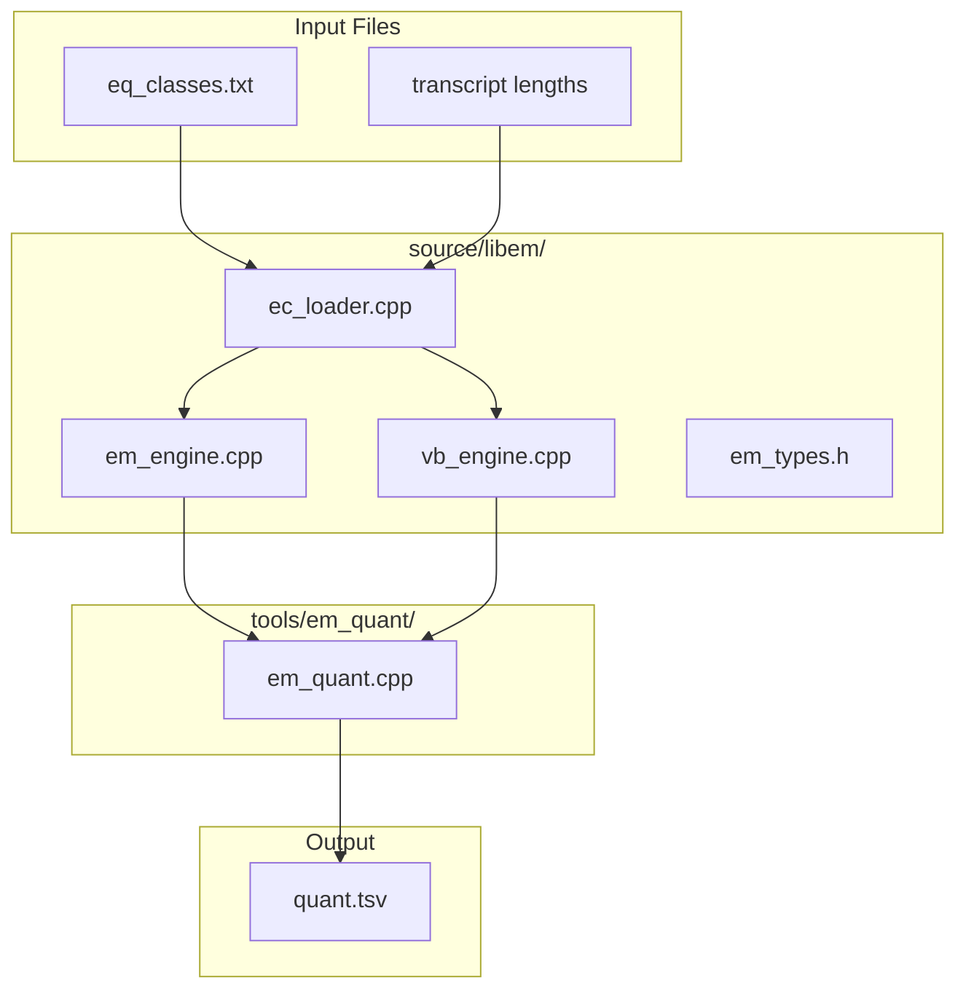

# EM/VB Quantification Engine Implementation Plan

## Overview

Implement a standalone C++ EM/VB quantifier over transcript equivalence classes (ECs) that achieves parity with Salmon on small fixtures. The implementation will be a self-contained library (`libem`) with a CLI tool (`em_quant`) for testing and validation.

**Note on v1 parity:** Parity will be measured against Salmon runs with bias correction disabled (no sequence bias, GC bias, or positional bias). Our v1 engine uses raw transcript lengths as effective lengths, which matches Salmon's behavior when bias modeling is off. Bias correction will be added in a future version.

## Architecture



## Directory Structure

```javascript
source/libem/
├── Makefile
├── em_types.h         # Data structures (SoA for transcripts, AoS for ECs)
├── ec_loader.h/cpp    # Salmon eq_classes.txt parser
├── em_engine.h/cpp    # Core EM algorithm
├── vb_engine.h/cpp    # VB extension with Dirichlet prior
└── libem.a

tools/em_quant/
├── Makefile
├── em_quant.cpp       # CLI tool
└── README.md

test/fixtures/salmon_eq/   # Already exists
├── eq_classes.txt
├── quant.sf
└── chr22_trans.fa
```

## Data Structures ([em_types.h](source/libem/em_types.h))

### Transcript State (SoA for SIMD/cache efficiency)

```cpp
struct TranscriptState {
    std::vector<std::string> names;      // transcript IDs
    std::vector<double> lengths;         // raw transcript lengths
    std::vector<double> eff_lengths;     // effective lengths (= lengths for v1)
    std::vector<double> abundances;      // current abundance estimates
    std::vector<double> counts;          // expected counts (after EM)
    size_t n;                            // number of transcripts
};
```

### Equivalence Class (AoS)

```cpp
struct EC {
    std::vector<uint32_t> transcript_ids;  // sorted indices into TranscriptState
    double count;                          // observed fragment count
};

struct ECTable {
    std::vector<EC> ecs;
    size_t n_ecs;
    size_t n_transcripts;
};
```

### EM Parameters

```cpp
struct EMParams {
    uint32_t max_iters = 1000;
    double tolerance = 1e-6;          // relative change in log-likelihood
    double vb_prior = 0.01;           // Dirichlet concentration (Salmon default)
    bool use_vb = false;              // --vb flag
    bool init_by_length = false;      // weight initial abundances by length
    int threads = 0;                  // 0 = OMP default
};

struct EMResult {
    std::vector<double> counts;       // estimated counts per transcript
    std::vector<double> tpm;          // TPM values
    double final_ll;                  // final log-likelihood
    uint32_t iterations;              // iterations until convergence
    bool converged;
};
```

## Implementation Details

### 1. EC Loader ([ec_loader.cpp](source/libem/ec_loader.cpp))

Parse Salmon's `eq_classes.txt` format:

- Line 1: number of transcripts
- Line 2: number of equivalence classes
- Lines 3 to (3+n_transcripts-1): transcript names
- Remaining lines: EC definitions as `<n_txp> <idx1> <idx2> ... <count>`
```cpp
// API
ECTable load_ec_file(const std::string& ec_path);
void load_transcript_lengths(TranscriptState& state, const std::string& quant_path);
```


### 2. EM Engine ([em_engine.cpp](source/libem/em_engine.cpp))

**Initialization:**

- Uniform: `abundance[i] = 1.0 / n_transcripts`
- Length-weighted: `abundance[i] = length[i] / sum(lengths)`

**E-step (parallelized over ECs):**

```cpp
#pragma omp parallel for num_threads(params.threads) schedule(dynamic)
for (size_t ec_idx = 0; ec_idx < n_ecs; ++ec_idx) {
    const EC& ec = ecs[ec_idx];
    double denom = 0.0;
    for (uint32_t tid : ec.transcript_ids) {
        denom += abundances[tid];
    }
    if (denom > 0) {
        for (uint32_t tid : ec.transcript_ids) {
            double responsibility = abundances[tid] / denom;
            #pragma omp atomic
            expected_counts[tid] += ec.count * responsibility;
        }
    }
}
```

**M-step (single-threaded for v1):**

```cpp
double total_counts = 0.0;
for (size_t i = 0; i < n_transcripts; ++i) {
    total_counts += expected_counts[i];
}
for (size_t i = 0; i < n_transcripts; ++i) {
    abundances[i] = expected_counts[i] / total_counts;
}
```

**Log-likelihood:**

```cpp
double compute_log_likelihood(const ECTable& ecs, const double* abundances) {
    double ll = 0.0;
    for (const EC& ec : ecs.ecs) {
        double prob = 0.0;
        for (uint32_t tid : ec.transcript_ids) {
            prob += abundances[tid];
        }
        if (prob > 0) {
            ll += ec.count * std::log(prob);
        }
    }
    return ll;
}
```

**Convergence check:**

```cpp
double rel_change = std::abs(ll - prev_ll) / (std::abs(prev_ll) + 1e-10);
if (rel_change < params.tolerance) {
    converged = true;
}
```

### 3. VB Engine ([vb_engine.cpp](source/libem/vb_engine.cpp))

Extends EM with Dirichlet prior:**VB M-step modification:**

```cpp
// Add pseudocounts from Dirichlet prior
for (size_t i = 0; i < n_transcripts; ++i) {
    expected_counts[i] += params.vb_prior;  // uniform Dirichlet
}
// Then normalize as in standard M-step
```

**ELBO for convergence (instead of log-likelihood):**

```cpp
double compute_elbo(const ECTable& ecs, const double* abundances, double vb_prior) {
    double ll = compute_log_likelihood(ecs, abundances);
    // Add Dirichlet prior term: sum((alpha-1) * log(theta))
    double prior_term = 0.0;
    for (size_t i = 0; i < n_transcripts; ++i) {
        if (abundances[i] > 0) {
            prior_term += (vb_prior - 1.0) * std::log(abundances[i]);
        }
    }
    return ll + prior_term;
}
```

### 4. CLI Tool ([em_quant.cpp](tools/em_quant/em_quant.cpp))

```javascript
Usage: em_quant [options] -e <eq_classes.txt> -o <output.tsv>

Options:
  -e, --ec <file>        Equivalence classes file (required)
  -l, --lengths <file>   Transcript lengths file (quant.sf format, optional)
  -o, --output <file>    Output TSV file (required)
  --vb                   Use Variational Bayes instead of EM
  --vb-prior <float>     Dirichlet prior concentration (default: 0.01)
  --max-iters <int>      Maximum iterations (default: 1000)
  --tolerance <float>    Convergence tolerance (default: 1e-6)
  --init-by-length       Initialize abundances by transcript length
  --threads <int>        Number of threads (default: OMP_NUM_THREADS)
  -v, --verbose          Verbose output
```

**Output format (TSV):**

```javascript
Name    Length    EffectiveLength    TPM    NumReads
ENST00000215754    557    557    6385.27    19.60
...
```

### 5. Build System

**[source/libem/Makefile](source/libem/Makefile):**

```makefile
CXX ?= g++
CXXFLAGS_common := -std=c++11 -O3 -march=native -fopenmp -Wall -Wextra

# OpenBLAS by default (not used in v1, but ready for future)
LDFLAGS_BLAS ?= -lopenblas

LIBEM_OBJECTS = ec_loader.o em_engine.o vb_engine.o

all: libem.a

libem.a: $(LIBEM_OBJECTS)
	$(AR) rcs $@ $^
	ranlib $@

%.o: %.cpp
	$(CXX) -c $(CXXFLAGS) $(CXXFLAGS_common) -I.. $< -o $@

clean:
	rm -f $(LIBEM_OBJECTS) libem.a

.PHONY: all clean
```

**[tools/em_quant/Makefile](tools/em_quant/Makefile):**

```makefile
CXX ?= g++
CXXFLAGS := -std=c++11 -O3 -march=native -fopenmp -Wall -Wextra
LDFLAGS := -fopenmp

LIBEM := ../../source/libem/libem.a

all: em_quant

em_quant: em_quant.cpp $(LIBEM)
	$(CXX) $(CXXFLAGS) -I../../source $< $(LIBEM) $(LDFLAGS) -o $@

$(LIBEM):
	$(MAKE) -C ../../source/libem

test: em_quant
	./run_parity_test.sh

clean:
	rm -f em_quant

.PHONY: all clean test
```

## Testing Strategy

### Unit Tests (Synthetic ECs)

Create a handcrafted fixture with known expected results:

```javascript
# test/fixtures/em_unit/eq_classes.txt
3          # 3 transcripts
3          # 3 ECs
T1
T2
T3
1 0 100    # 100 reads map uniquely to T1
1 1 50     # 50 reads map uniquely to T2
2 0 1 30   # 30 reads map ambiguously to T1 or T2
```

Expected result (with uniform init):

- T1: ~115 reads (100 unique + ~15 from ambiguous)
- T2: ~65 reads (50 unique + ~15 from ambiguous)
- T3: 0 reads

### Parity Test (Salmon Fixture)

Compare against existing `test/fixtures/salmon_eq/`. **Important:** The Salmon fixture must be generated with bias correction disabled (`--noSeqBias --noGCBias --noPosBias` or equivalent flags) to match our v1 engine which uses raw transcript lengths as effective lengths.

```bash
#!/bin/bash
# tools/em_quant/run_parity_test.sh

./em_quant -e ../../test/fixtures/salmon_eq/eq_classes.txt \
           -l ../../test/fixtures/salmon_eq/quant.sf \
           -o /tmp/em_quant_output.tsv

# Compare NumReads with tolerance
python3 compare_quant.py \
    ../../test/fixtures/salmon_eq/quant.sf \
    /tmp/em_quant_output.tsv \
    --tolerance 1e-4
```

## Implementation Order

1. **Phase 1: Core Library**

- `em_types.h` - Data structures
- `ec_loader.cpp` - File parser
- `em_engine.cpp` - Basic EM loop
- `libem/Makefile`

2. **Phase 2: CLI Tool**

- `em_quant.cpp` - Command-line interface
- `tools/em_quant/Makefile`
- Manual testing with Salmon fixture

3. **Phase 3: VB Extension**

- `vb_engine.cpp` - VB with Dirichlet prior
- `--vb` flag integration

4. **Phase 4: Testing**

- Synthetic unit test fixture
- `run_parity_test.sh`
- `compare_quant.py` for tolerance checking
- Integration into main Makefile

5. **Phase 5: Documentation**

- `tools/em_quant/README.md`
- Update `test/fixtures/salmon_eq/README.md`

## Key Design Decisions

| Decision | Choice | Rationale |

|----------|--------|-----------|

| Precision | `double` | Numerical stability over performance |

| BLAS | OpenBLAS (build-time) | Widely available, good performance |

| xsimd | Deferred | `-O3 -march=native` sufficient for v1 |

| Threading | OMP on E-step | ECs are independent; M-step is cheap |

| VB prior | Uniform Dirichlet (0.01) | Matches Salmon's `--vbPrior` default |

| Parity target | NumReads, 1e-4 relative | Primary metric, reasonable tolerance |

| Memory layout | SoA transcripts, AoS ECs | Cache-friendly for hot loops |

| Bias correction | Disabled for v1 | Matches Salmon with bias flags off; bias layer deferred |

## Future Integration

When integrating into STAR:

- Add `--quantMode TranscriptEM` option
- Call `run_em()` API from existing quantification path