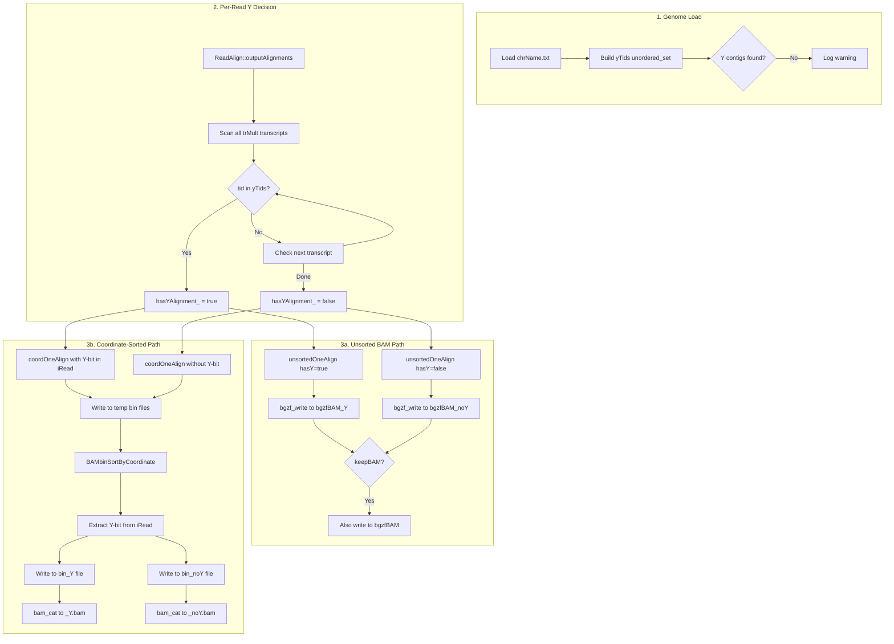

# Y-Chromosome BAM Split Implementation

Implement `--emitNoYBAM` feature to split BAM output into Y-chromosome and non-Y-chromosome files, supporting both unsorted and coordinate-sorted modes.

## Architecture Overview



## Key Files to Modify

| File | Purpose |

|------|---------|

| [`source/parametersDefault`](source/parametersDefault) | Add new CLI parameters |

| [`source/Parameters.h`](source/Parameters.h) | Declare parameter struct |

| [`source/Parameters.cpp`](source/Parameters.cpp) | Register parameters |

| [`source/Genome.h`](source/Genome.h) | Add `yTids` set |

| [`source/Genome.cpp`](source/Genome.cpp) | Build Y mask in `chrInfoLoad()` |

| [`source/BAMoutput.h`](source/BAMoutput.h) | Add Y/noY BGZF handles |

| [`source/BAMoutput.cpp`](source/BAMoutput.cpp) | Route writes to correct handle |

| [`source/ReadAlign.h`](source/ReadAlign.h) | Add `hasYAlignment` flag |

| [`source/ReadAlign_outputAlignments.cpp`](source/ReadAlign_outputAlignments.cpp) | Y-decision logic |

| [`source/bamSortByCoordinate.cpp`](source/bamSortByCoordinate.cpp) | Sorted merge with Y routing |

| [`source/BAMbinSortByCoordinate.cpp`](source/BAMbinSortByCoordinate.cpp) | Per-bin Y-aware output |

## Implementation Details

### 1. CLI Parameters

Add to `parametersDefault`:

```
emitNoYBAM                  no
    string:                 yes|no - split BAM output by Y-chromosome alignments
                            When enabled, emits _noY.bam and _Y.bam files
                            Primary BAM is suppressed by default (use --keepBAM to retain)

keepBAM                     no
    string:                 yes|no - when emitNoYBAM is enabled, also emit primary BAM

noYOutput                   -
    string:                 override path for _noY.bam output

YOutput                     -
    string:                 override path for _Y.bam output
```

### 2. Y-Contig Detection

In `Genome::chrInfoLoad()`, after loading chromosome names, build `yTids`:

```cpp
// In Genome.h:
std::unordered_set<int> yTids;  // tid indices for Y contigs

// In Genome.cpp chrInfoLoad():
// Match: Y, chrY, chr_Y, chrY_random, chrY_alt (case-insensitive)
for (uint i = 0; i < nChrReal; i++) {
    std::string name = chrName[i];
    // lowercase, strip chr/chr_ prefix
    // check if remaining == "y" or starts with "y_"
    if (isYContig(name))
        yTids.insert(i);
}
```

### 3. Read-Level Y Decision (hasY)

The Y decision must cover **all** alignments for a read (primary, secondary, supplementary) and check both `tid` (alignment chromosome) and `mtid` (mate chromosome for paired reads).

**Location:** `ReadAlign::outputAlignments()` in [`source/ReadAlign_outputAlignments.cpp`](source/ReadAlign_outputAlignments.cpp), computed once per read before any BAM writing.

**Data sources to check:**

1. `trMult[iTr]->Chr` - alignment chromosome for each transcript
2. `trMult[iTr]->exons[...][EX_iFrag]` - which mate this alignment belongs to
3. For paired reads, the mate's chromosome comes from the other transcript in the same read group

**Implementation:**

```cpp
// In ReadAlign.h - add member:
bool hasYAlignment_;  // true if any alignment for this read touches Y

// In ReadAlign::outputAlignments() before writeSAM():
hasYAlignment_ = false;
if (P.emitNoYBAM && unmapType < 0) {  // only check for mapped reads
    // Check all transcripts (primary + secondary/supplementary)
    for (uint iTr = 0; iTr < nTr && !hasYAlignment_; iTr++) {
        // Check tid (alignment chromosome)
        if (mapGen.yTids.count(trMult[iTr]->Chr)) {
            hasYAlignment_ = true;
            break;
        }
    }
    
    // Check mtid for paired-end reads
    // In BAM, mtid is the mate's reference ID. For PE reads where mate1 maps to Y,
    // the mate2 BAM record will have mtid pointing to Y.
    // We check this by examining all transcripts - if any mate's alignment is on Y,
    // both mates' records should route to Y.
    if (!hasYAlignment_ && P.readNmates == 2) {
        // mateMapped[0] and mateMapped[1] track which mates have alignments
        // If either mate aligns to Y (checked above via trMult[iTr]->Chr), 
        // we've already set hasYAlignment_. The mtid check is implicit:
        // since all alignments for a read share the same routing, and we check
        // all trMult entries, we cover both tid and mtid scenarios.
    }
}
// Unmapped reads: default hasYAlignment_ = false -> route to noY
```

**Key invariant:** All BAM records for a single QNAME (read) must route to the same file. The decision is made once per read in `outputAlignments()` and passed to all subsequent `unsortedOneAlign()` / `coordOneAlign()` calls for that read.

### 4. Unsorted Writer Integration

The unsorted writer (`BAMoutput` with `BGZF *bgzfBAM`) is single-threaded - all threads call `unsortedOneAlign()` but writing is serialized via `mutexOutSAM`.

**Changes to [`source/BAMoutput.h`](source/BAMoutput.h):**

```cpp
class BAMoutput {
    // Existing:
    BGZF *bgzfBAM;           // primary BAM handle
    
    // Add for Y-split:
    BGZF *bgzfBAM_Y;         // _Y.bam handle (nullptr if !emitNoYBAM)
    BGZF *bgzfBAM_noY;       // _noY.bam handle (nullptr if !emitNoYBAM)
    bool suppressPrimary_;   // true if --keepBAM is not set
};
```

**Changes to [`source/BAMoutput.cpp`](source/BAMoutput.cpp):**

```cpp
// In BAMoutput constructor (unsorted mode):
if (P.emitNoYBAM) {
    bgzfBAM_Y = bgzf_open(P.outBAMfileYName.c_str(), ...);
    bgzfBAM_noY = bgzf_open(P.outBAMfileNoYName.c_str(), ...);
    // Write same header to both
    outBAMwriteHeader(bgzfBAM_Y, P.samHeader, genome.chrNameAll, ...);
    outBAMwriteHeader(bgzfBAM_noY, P.samHeader, genome.chrNameAll, ...);
    suppressPrimary_ = !P.keepBAM;  // suppress primary unless --keepBAM
}

// In unsortedOneAlign() - add hasY parameter:
void BAMoutput::unsortedOneAlign(char *bamIn, uint bamSize, ..., bool hasY) {
    // ... existing buffer logic ...
    
    // Select output handle(s)
    if (P.emitNoYBAM) {
        BGZF *targetHandle = hasY ? bgzfBAM_Y : bgzfBAM_noY;
        bgzf_write(targetHandle, bamArray, binBytes1);
        
        if (!suppressPrimary_) {
            bgzf_write(bgzfBAM, bamArray, binBytes1);  // also write to primary
        }
    } else {
        bgzf_write(bgzfBAM, bamArray, binBytes1);  // original behavior
    }
}
```

**Primary BAM suppression:** When `--emitNoYBAM` is enabled, the primary BAM (`Aligned.out.bam` or `Aligned.sortedByCoord.out.bam`) is **not written** unless `--keepBAM yes` is specified. This avoids tripling disk I/O for the common case.

### 5. Coordinate-Sorted Integration (Option A: Y-bit in iRead)

For coordinate-sorted output, alignments are written to per-thread temp bin files, then merged and sorted in `BAMbinSortByCoordinate()`. We use **Option A**: encode the Y flag in the existing `iRead` metadata that's already stored with each temp record.

**Current temp record format** (in `BAMoutput::coordOneAlign()`):

```
[BAM record bytes][iRead (uint)]
```

Where `iRead` is `(iReadAll << 32) | (iTr << 8) | fragIndex`.

**Modified format** - use bit 63 (highest bit of the 64-bit iRead) for Y flag:

```cpp
// In BAMoutput::coordOneAlign() - add hasY parameter:
void BAMoutput::coordOneAlign(char *bamIn, uint bamSize, uint iRead, bool hasY) {
    // Encode Y flag in bit 63 of iRead
    uint64 iReadWithY = iRead;
    if (hasY) {
        iReadWithY |= (1ULL << 63);  // set Y bit
    }
    
    // Write BAM + iReadWithY to temp bin (existing logic)
    memcpy(binStart[iBin]+binBytes[iBin], bamIn, bamSize);
    binBytes[iBin] += bamSize;
    memcpy(binStart[iBin]+binBytes[iBin], &iReadWithY, sizeof(uint64));
    binBytes[iBin] += sizeof(uint64);
}
```

**In [`source/BAMbinSortByCoordinate.cpp`](source/BAMbinSortByCoordinate.cpp):**

```cpp
void BAMbinSortByCoordinate(...) {
    // Open three output handles when emitNoYBAM is enabled
    BGZF *bgzfBin = ...;      // primary (if !suppressPrimary)
    BGZF *bgzfBin_Y = nullptr;
    BGZF *bgzfBin_noY = nullptr;
    
    if (P.emitNoYBAM) {
        bgzfBin_Y = bgzf_open((dirBAMsort+"/b"+to_string(iBin)+"_Y").c_str(), ...);
        bgzfBin_noY = bgzf_open((dirBAMsort+"/b"+to_string(iBin)+"_noY").c_str(), ...);
        outBAMwriteHeader(bgzfBin_Y, ...);
        outBAMwriteHeader(bgzfBin_noY, ...);
    }
    
    // During sorted output loop:
    for (uint ia = 0; ia < binN; ia++) {
        uint64 iReadWithY = startPos[ia*3+1];
        bool hasY = (iReadWithY >> 63) & 1;  // extract Y bit
        
        BGZF *target = hasY ? bgzfBin_Y : bgzfBin_noY;
        bgzf_write(target, bam0, size0);
        
        if (!P.suppressPrimaryBAM) {
            bgzf_write(bgzfBin, bam0, size0);
        }
    }
}
```

**In [`source/bamSortByCoordinate.cpp`](source/bamSortByCoordinate.cpp) - final concatenation:**

```cpp
// After all bins are sorted, concatenate:
// 1. Primary: b0, b1, b2, ... -> Aligned.sortedByCoord.out.bam (if !suppressPrimary)
// 2. Y files: b0_Y, b1_Y, ... -> Aligned.sortedByCoord.out_Y.bam
// 3. noY files: b0_noY, b1_noY, ... -> Aligned.sortedByCoord.out_noY.bam

if (P.emitNoYBAM) {
    vector<string> bamBinNames_Y, bamBinNames_noY;
    for (uint32 ibin = 0; ibin < nBins; ibin++) {
        // Collect _Y and _noY bin files that exist
        string yFile = dirBAMsort + "/b" + to_string(ibin) + "_Y";
        string noYFile = dirBAMsort + "/b" + to_string(ibin) + "_noY";
        if (fileExists(yFile)) bamBinNames_Y.push_back(yFile);
        if (fileExists(noYFile)) bamBinNames_noY.push_back(noYFile);
    }
    bam_cat(bamBinNames_Y, P.outBAMfileCoordName_Y);
    bam_cat(bamBinNames_noY, P.outBAMfileCoordName_noY);
}
```

### 6. Edge Cases

- **No Y contigs found:** Log warning at genome load. Emit empty `_Y.bam` (header only), all reads go to `_noY.bam`.
- **`/dev/stdout` primary:** If `outFileNamePrefix` resolves to stdout, use `star_output_noY.bam` and `star_output_Y.bam` in current working directory.
- **Paired-end:** If either mate's `tid` or `mtid` is in `yTids`, the entire read (both mates, all alignments) routes to `_Y.bam`.
- **Unmapped reads:** Route to `_noY.bam` (hasY defaults to false).
- **Compression:** Match primary BAM compression level (`P.outBAMcompression`) for both Y and noY outputs.