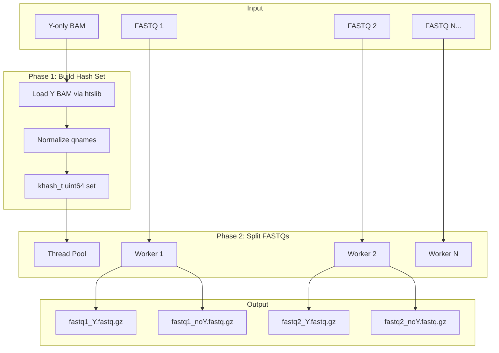

# Y/NoY FASTQ Splitter Tool Implementation Plan

## Architecture



## Key Files

| File | Purpose |

|------|---------|

| [tools/remove_y_reads/remove_y_reads.c](tools/remove_y_reads/remove_y_reads.c) | Main implementation |

| [tools/remove_y_reads/Makefile](tools/remove_y_reads/Makefile) | Build configuration |

| [source/htslib/htslib/sam.h](source/htslib/htslib/sam.h) | BAM reading API |

| [source/htslib/htslib/khash.h](source/htslib/htslib/khash.h) | Hash table implementation |

| [tests/run_remove_y_reads_test.sh](tests/run_remove_y_reads_test.sh) | Test script |

## Implementation Steps

### Step 1: Create Directory Structure and Makefile

Create `tools/remove_y_reads/` directory with a Makefile following the pattern from [tools/flexfilter/Makefile](tools/flexfilter/Makefile):

```c
// Build configuration
HTSLIB_DIR = ../../source/htslib
CC = gcc
CFLAGS = -O3 -Wall -Wextra -pthread -I$(HTSLIB_DIR)
LDFLAGS = -L$(HTSLIB_DIR) -lhts -lz -lpthread
```

### Step 2: Implement Y BAM Loader

Use htslib to iterate BAM records and build hash set:

```c
#include "htslib/sam.h"
#include "htslib/khash.h"

// Define hash set type for 64-bit hashes
KHASH_SET_INIT_INT64(qname_set)

// Hash function (FNV-1a 64-bit)
static inline uint64_t hash_qname(const char *s, int len) {
    uint64_t h = 14695981039346656037ULL;
    for (int i = 0; i < len; i++) {
        h ^= (uint64_t)(unsigned char)s[i];
        h *= 1099511628211ULL;
    }
    return h;
}

// Normalize qname: strip leading @, trailing /1 or /2, whitespace
static int normalize_qname(const char *raw, char *out, int max_len);

// Load Y BAM into hash set
khash_t(qname_set) *load_y_bam(const char *bam_path, int *count);
```

Key implementation details:

- Use `sam_open()`, `sam_hdr_read()`, `bam_read1()` from htslib
- Extract qname with `bam_get_qname()`
- Normalize (strip `/1`, `/2`, whitespace) before hashing
- Store 64-bit hash in khash set
- Return count of unique Y read names

### Step 3: Implement FASTQ Splitter

Stream FASTQ in 4-line blocks with gzip support:

```c
#include <zlib.h>

typedef struct {
    gzFile in;
    gzFile out_y;
    gzFile out_noy;
    khash_t(qname_set) *y_set;
    char *inpath;
    long total, y_count, noy_count;
} fastq_worker_t;

// Process single FASTQ file
void *process_fastq(void *arg) {
    fastq_worker_t *w = (fastq_worker_t *)arg;
    char line1[4096], line2[65536], line3[4096], line4[65536];
    
    // Set large buffer for better I/O (MANDATORY per plan)
    gzbuffer(w->in, 128 * 1024);
    gzbuffer(w->out_y, 128 * 1024);
    gzbuffer(w->out_noy, 128 * 1024);
    
    while (gzgets(w->in, line1, sizeof(line1))) {
        // Read 4 lines (FASTQ record)
        gzgets(w->in, line2, sizeof(line2));
        gzgets(w->in, line3, sizeof(line3));
        gzgets(w->in, line4, sizeof(line4));
        
        // Normalize read name from line1, hash, lookup
        char norm[256];
        normalize_qname(line1 + 1, norm, sizeof(norm));
        uint64_t h = hash_qname(norm, strlen(norm));
        
        khint_t k = kh_get(qname_set, w->y_set, h);
        gzFile out = (k != kh_end(w->y_set)) ? w->out_y : w->out_noy;
        
        // Write 4 lines to appropriate output
        gzputs(out, line1);
        gzputs(out, line2);
        gzputs(out, line3);
        gzputs(out, line4);
        
        w->total++;
        if (k != kh_end(w->y_set)) w->y_count++; else w->noy_count++;
    }
    return NULL;
}
```

Key implementation details:

- Detect gzip by `.gz` extension
- Use `gzopen()` with mode `"rb"` or `"r"` for input
- Use `gzopen()` with mode `"wb"` for output (honors `--gzip-level`)
- Call `gzbuffer()` on all handles (128KB buffer)
- Preserve read order by sequential processing within each file

### Step 4: Implement Threading

File-level parallelism with pthread:

```c
#include <pthread.h>

typedef struct {
    int num_threads;
    int num_files;
    char **fastq_paths;
    char *out_dir;
    khash_t(qname_set) *y_set;
    int gzip_level;
} split_context_t;

void split_all_fastqs(split_context_t *ctx) {
    pthread_t *threads = malloc(ctx->num_files * sizeof(pthread_t));
    fastq_worker_t *workers = malloc(ctx->num_files * sizeof(fastq_worker_t));
    
    // Spawn workers (bounded by num_threads via semaphore or sequential batching)
    for (int i = 0; i < ctx->num_files; i++) {
        setup_worker(&workers[i], ctx, ctx->fastq_paths[i]);
        pthread_create(&threads[i], NULL, process_fastq, &workers[i]);
    }
    
    // Join all
    for (int i = 0; i < ctx->num_files; i++) {
        pthread_join(threads[i], NULL);
        // Log counts
        fprintf(stderr, "%s: total=%ld Y=%ld noY=%ld\n",
                workers[i].inpath, workers[i].total, 
                workers[i].y_count, workers[i].noy_count);
    }
}
```

For thread limiting (if `--threads N` < num_files), use a semaphore or process in batches.

### Step 5: Implement CLI

Use getopt for argument parsing:

```c
static void print_usage(const char *prog) {
    fprintf(stderr, "Usage: %s -y <Y.bam> [-o <out_dir>] [--threads N] "
                    "[--gzip-level N] [--strip-mate] fastq1 [fastq2 ...]\n", prog);
    fprintf(stderr, "\nOptions:\n");
    fprintf(stderr, "  -y, --ybam FILE     Y-only BAM file (required)\n");
    fprintf(stderr, "  -o, --outdir DIR    Output directory (default: alongside input)\n");
    fprintf(stderr, "  -t, --threads N     Number of threads (default: 1)\n");
    fprintf(stderr, "  -z, --gzip-level N  Gzip compression level 1-9 (default: 6)\n");
    fprintf(stderr, "  --strip-mate        Strip /1 /2 suffixes (default: on)\n");
    fprintf(stderr, "  -h, --help          Show this help\n");
}

int main(int argc, char **argv) {
    // Parse args with getopt_long
    // Load Y BAM
    // Split FASTQs
    // Report summary
}
```

### Step 6: Output Naming

```c
// Given input: sample_R1.fastq.gz
// Output: sample_R1_Y.fastq.gz, sample_R1_noY.fastq.gz

void derive_output_paths(const char *inpath, const char *outdir,
                         char *y_path, char *noy_path, int max_len) {
    const char *base = strrchr(inpath, '/');
    base = base ? base + 1 : inpath;
    
    // Find .fastq.gz or .fq.gz or .fastq or .fq
    char stem[256], ext[32];
    parse_fastq_name(base, stem, ext);
    
    if (outdir) {
        snprintf(y_path, max_len, "%s/%s_Y%s", outdir, stem, ext);
        snprintf(noy_path, max_len, "%s/%s_noY%s", outdir, stem, ext);
    } else {
        // Place alongside input
        char dir[256];
        get_dirname(inpath, dir);
        snprintf(y_path, max_len, "%s/%s_Y%s", dir, stem, ext);
        snprintf(noy_path, max_len, "%s/%s_noY%s", dir, stem, ext);
    }
}
```

### Step 7: Add Test Script

Create [tests/run_remove_y_reads_test.sh](tests/run_remove_y_reads_test.sh):

```bash
#!/bin/bash
# Test remove_y_reads tool

# Use existing Y BAM from Y-split test
Y_BAM="/tmp/ychrom_bulk_pe_test/sorted_split/Aligned.sortedByCoord.out_Y.bam"
FASTQ_R1="/storage/PE/downsampled/21033-09-01-13-01_S1_L007_R1_001.fastq.gz"
FASTQ_R2="/storage/PE/downsampled/21033-09-01-13-01_S1_L007_R2_001.fastq.gz"

# Run tool
./tools/remove_y_reads/remove_y_reads -y "$Y_BAM" -o /tmp/remove_y_test \
    --threads 2 "$FASTQ_R1" "$FASTQ_R2"

# Validate:
# 1. Y FASTQ read names are subset of Y BAM read names
# 2. noY FASTQ read names have no overlap with Y BAM
# 3. Y + noY = original total reads
# 4. Order preserved (diff line numbers of original vs concatenated)
```

### Step 8: Documentation

Add section to [README_flex.md](README_flex.md) under a new "Companion Tools" section:

```markdown
### remove_y_reads - FASTQ Splitter

Splits FASTQ files based on a Y-only BAM, producing Y/noY partitions:

\`\`\`bash
./tools/remove_y_reads/remove_y_reads -y Aligned_Y.bam \
    --threads 4 sample_R1.fastq.gz sample_R2.fastq.gz
\`\`\`

Output: `sample_R1_Y.fastq.gz`, `sample_R1_noY.fastq.gz`, etc.
```

## Build Integration

Add make target to main [source/Makefile](source/Makefile):

```makefile
remove_y_reads:
	$(MAKE) -C ../tools/remove_y_reads
```

## Testing Checklist

1. **Unit test**: Small Y BAM (3 reads) + small FASTQ (10 reads, 3 in Y) -> verify counts
2. **Gzip test**: Both gzipped and plain FASTQ inputs
3. **Threading test**: Multiple FASTQs processed in parallel
4. **Order test**: Verify read order preserved in outputs
5. **E2E test**: Use real Y BAM from STAR split + original FASTQs

## Deliverables

- `tools/remove_y_reads/remove_y_reads.c` - Main source (~400-500 lines)
- `tools/remove_y_reads/Makefile` - Build configuration
- `tests/run_remove_y_reads_test.sh` - Test script
- Documentation in `README_flex.md`